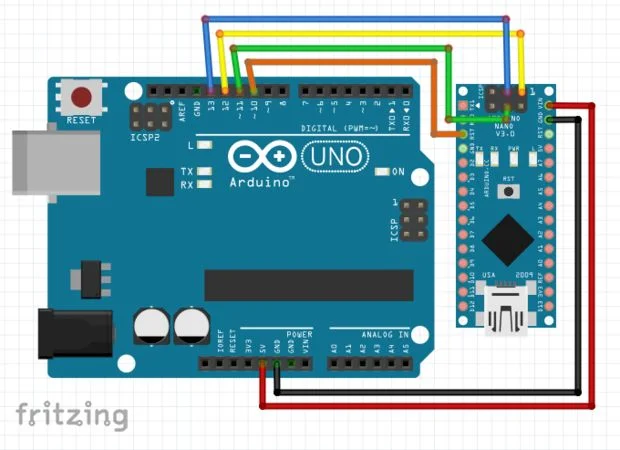

### Components:
- Arduino Uno
- Arduino Nano
- Jumper Wires
- Bread Board (Optional)
### Connections

| Uno Pin | Nano Pin    |
| ------- | ----------- |
| D 13    | SCK         |
| D 12    | MISO        |
| D 11    | MOSI        |
| D 10    | RST (reset) |
| 5 V     | VIN         |
| GND     | GND         |

---
Related Links:-
- [Arduino](Arduino.md)