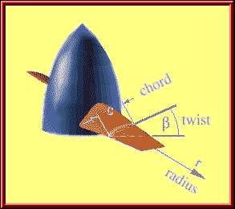

Angle between the chord of propeller or rotor blade and a plane normal to the axis of rotation, its value varying along the span and decreasing from root to tip because of blade twist.

---
# Related 
- [Propellers](Propellers.md) 