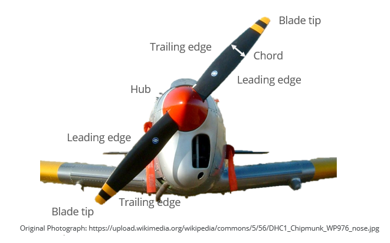
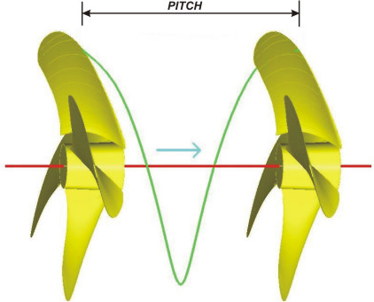
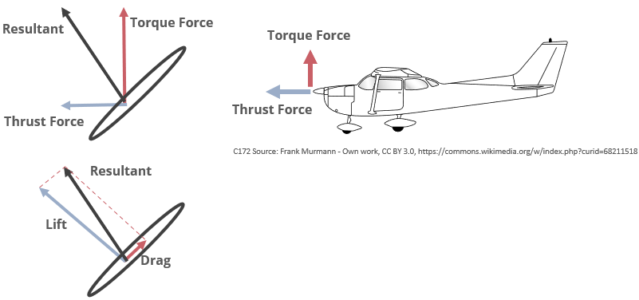

A propeller, like an airplane wing, is an [Aerofoils](Aerofoils.md). When air moves over the surface of a moving propeller on an airplane, the air pressure in front of the propeller is reduced or velocity of air in front of propeller is increased, and the air pressure behind the propeller increased or velocity of air behind the propeller is decreased. The pressure imbalance tends to push the airplane forward. We say that the propeller is generating ***thrust***.

The same principle applies to helicopter propellers, only now the propeller rotates around the vertical axis. The pressure on top of the propeller is reduced hence, velocity of air increased and the pressure underneath is increased hence, velocity of air decreased, generating ***lift***.
# Nomenclature

# Pitch
> The displacement a propeller makes in a complete spin of $360\degree$ degrees.

This means that if we have a propeller of pitch 40 is will advance 40 inches for every complete spin as long as this is made is a solid surface; in a liquid environment, the propeller will obviously slide with less displacement.

The pitch concept is not exclusive for propellers, other mechanical devices like screws also use it. For instance, a screw with 10 mm of pitch will advance 10 mm for every complete turn when hit by the screwdriver. In fact, the "screw propeller" concept is literally making reference to that the propeller works exactly like a screw.

### High Pitch
If for any given HP (Horse-Power) the pitch is too big, the propeller becomes heavy and demands more power than the engine can reach and vice versa.
### Low Pitch
If the pitch is too small then we have a light propeller that wouldn't absorb the engine's full power

## Efficiency

The efficiency of a propeller is determined by,

- Thrust coefficient $$c_{T} = \frac{T}{\rho.n^2.D^4}$$
- torque coefficient $$c_{Q}=\frac{Q}{\rho.n^2.D^5}$$
- propeller power coefficient. $$c_{P}=\frac{P}{\rho.n^2.D^5}$$

Where, 

- $\rho$ is air density
- $n$ is propeller rotational speed 
- $D$ is propeller diameter

# Thrust

A propeller bade is simply a rotating wing, which means that it will produce lift and drag in the same way as a conventional wing. 

Propeller thrust is dependent on the properties of the propeller and air around it
Equation can be expressed in a two different ways.

- Static thrust
- Dynamic thrust 

#### Static thrust

Thrust is dependent on the mass flow rate of the air and the change in air velocity: 

$$
F_{\text{thrust}}=m \times [V_{e}-V_{o}]
$$

Where,

- $m$ = mass flow rate
- $V_{e}$ = exit velocity of air
- $V_{o}$ entrance velocity of air

The mass flow rate can be expressed as,
$$m=\rho \times V_{p} \times A$$
Where,

- $\rho$ is the air density
- $A$ is the cross-sectional area of the propeller.
- $V_{p}$ is the incoming air velocity.
# Design Variables
There are three primary design variables that affect the operation of a propeller: 
- Diameter
- Number of blades
- Propeller Pitch
### Diameter
A propeller produces thrust through a momentum transfer from the blades to a column of air approximately equal to the diameter of the propeller. It stands to a reason then that **increasing the diameter will increase the momentum (the mass component of the momentum equation), and hence the thrust.** This is indeed the case, and it is a well-established design practice to make the propeller as large as practically possible.

There are several limiting factors to the propeller diameter that can be accommodated on a given engine, are-
1. **Torque**
	- Large propeller brings increased torque, because moment of inertial of the blade increases exponentially with blade diameter, which results in a much larger resulting propeller torque.
	- A large diameter also results in much larger centrifugal forces in the blade, with higher resulting stresses that much be accommodated.
2. **Tip Speed**
	- Increased blade diameter also increases the tip speed.
	- If the diameter gets too large then the tip could reach sonic speeds which results in noise, vibration, and a large increase in drag. This is undesirable and should always be avoided.
