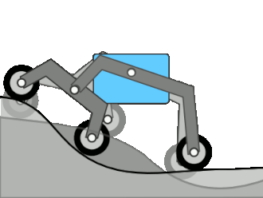

The **rocker-bogie mechanism** is a suspension system primarily used in rover designs, such as NASA’s Mars rovers, to maintain stability and navigate uneven terrains. It's known for its capability to traverse obstacles much larger than the diameter of the wheels while keeping all six wheels on the ground. Below is a detailed breakdown of how it works and its key components:

### 1. **Components of the Rocker-Bogie System:**

- **Rocker:** The “rocker” refers to the larger, longer arm on each side of the rover that is attached to two wheels—one at the front and one at the middle. The rocker pivots about a central point on the chassis. When one rocker tilts up as a wheel climbs an obstacle, the opposite side rocker tilts down, stabilizing the chassis.
  
- **Bogie:** The “bogie” is the smaller arm connected to the rear wheel. It pivots about the end of the rocker. This design helps keep the vehicle stable and level while the wheels follow the contour of the terrain.

- **Differential Bar:** A differential pivot connects the rockers on each side of the vehicle. This allows for independent movement of the left and right sides, enabling the rover to remain balanced even when encountering uneven terrain on just one side.

- **Wheels:** Typically, rovers using the rocker-bogie system have six wheels. These wheels are often equipped with cleats or treads to improve traction on loose or slippery surfaces like sand, gravel, or rocks.

### 2. **Working Principle:**

The system’s key feature is its ability to traverse obstacles up to twice the diameter of its wheels while keeping the body of the rover stable. The wheels' independent suspension allows the rocker-bogie to adjust to different ground elevations.

- **Obstacle Navigation:** 
  - When a wheel climbs over an obstacle (e.g., a rock or ledge), the bogie pivots upward while the other wheels maintain contact with the ground. The rocker on the other side compensates by moving downward.
  - As a result, the chassis remains relatively level, and the vehicle’s center of gravity stays low, minimizing the risk of tipping.

- **Load Distribution:** 
  - The rocker-bogie system distributes the load across all six wheels, reducing stress on any single point of the vehicle. This distribution improves traction and helps the vehicle avoid getting stuck in loose terrain.

### 3. **Advantages of the Rocker-Bogie Mechanism:**

- **Stability:** The suspension keeps the rover stable on rough terrain, avoiding tipping even when traversing steep slopes or large obstacles.
  
- **Obstacle Climbing:** The mechanism can climb over obstacles more than twice the height of the wheels, making it ideal for environments like the Martian surface.

- **Wheel Ground Contact:** All six wheels are designed to maintain ground contact at all times, improving traction and mobility.

- **Low Complexity:** The rocker-bogie system does not use springs or complex actuators, which reduces the chances of mechanical failure, especially in the harsh conditions of space exploration.

### 4. **Applications:**

- **Mars Rovers:** The rocker-bogie suspension system has been used in several NASA Mars rovers, including **Sojourner**, **Spirit**, **Opportunity**, **Curiosity**, and **Perseverance**. It has been critical in allowing these rovers to explore the rocky Martian surface and collect scientific data.
  
- **Off-Road Robotics:** The mechanism is also useful in autonomous off-road vehicles, especially in rough terrains where traditional wheeled suspension systems might struggle.

### 5. **Challenges and Limitations:**

- **Speed:** The rocker-bogie system is optimized for stability and obstacle climbing rather than speed. Rovers using this system typically move very slowly, making it unsuitable for high-speed applications.
  
- **Steep Slopes:** While the mechanism provides excellent stability, steep slopes (above 30-40 degrees) may still present challenges due to traction loss or slipping.

- **Energy Efficiency:** Navigating rough terrain can increase the energy consumption of the rover, as more effort is needed to maintain traction and stability on uneven surfaces.

### 6. **Key Features to Explore for a Hackathon Project:**

- **Wheel Materials and Design:** Consider experimenting with wheel materials for better grip on various surfaces.
  
- **Suspension Tuning:** Modifying the suspension to optimize for different terrains can make a big difference in a rover’s effectiveness.
  
- **Control Algorithms:** Implementing algorithms that control the speed and movement of each wheel individually could enhance performance on difficult terrain.

The rocker-bogie mechanism’s simplicity and effectiveness make it a go-to solution for space exploration and robotics applications in harsh environments.