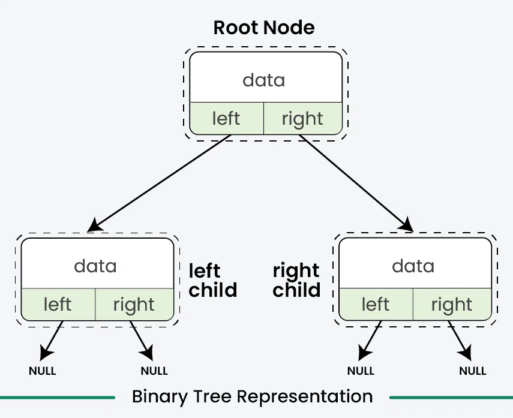
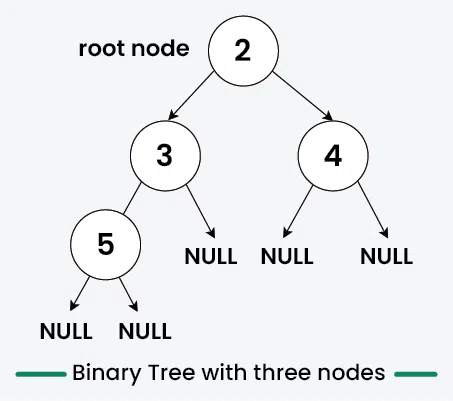
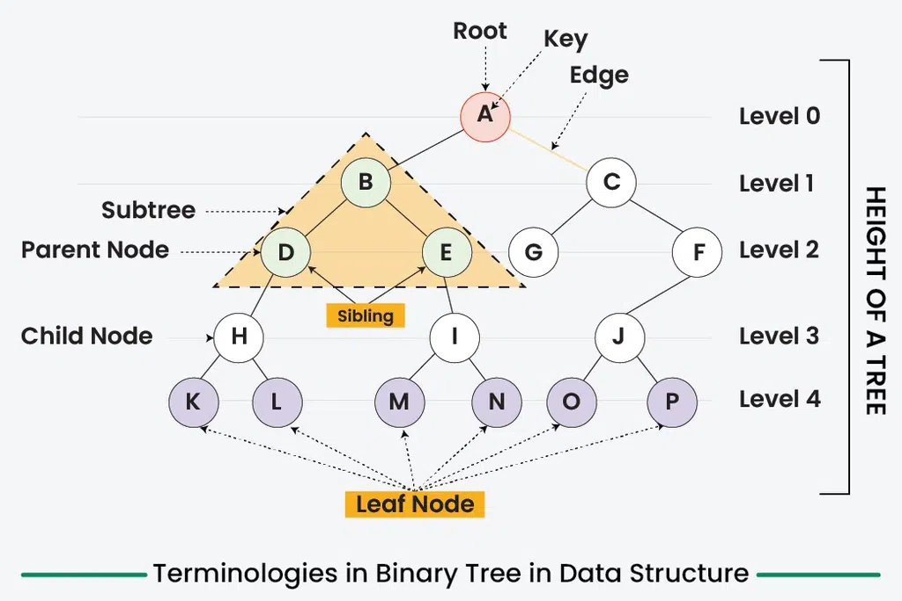

---
tags:
  - DSA
  - BinaryTree
---
**Binary Tree** is a **non-linear data structure** where each node has at most two children. In this article, we will cover all the basics of Binary Tree. Operations on Binary Tree, its implementation, advantages, disadvantages which will help you solve all the problems based on Binary Tree.

## What is Binary Tree?
Binary tree is a **tree data structure (non-linear)** in which each node can have **at most two children** which are referred to as the **left child** and the **right child.**

The top-most node in a binary tree is called the **root**, and the bottom-most nodes are called **leaves**. A binary tree can be visualized as a hierarchical structure with the root at the top and the leaves at the bottom.
## Representation 
Each node in a Binary Tree has three parts:
- Data
- Pointer to the left child
- Pointer to the right child


**Create/Declare a Node of a Binary Tree**
Syntax to declare a Node of Binary Tree in different languages:
````tabs

tab: C++
```cpp
// Use any below method to implement Nodes of binary tree

// 1: Using struct
struct Node {
    int data;
    Node* left, * right;

    Node(int key) {
        data = key;
        left = nullptr;
        right = nullptr;
    }
};

// 2: Using class
class Node {
public:
    int data;
    Node* left, * right;

    Node(int key) {
        data = key;
        left = nullptr;
        right = nullptr;
    }
};
```
tab: C
```c
// Structure of each node of the tree. 
struct Node {
    int data;
    struct Node* left;
    struct Node* right;
};

// Note : Unlike other languages, C does not support 
// Object Oriented Programming. So we need to write 
// a separat method for create and instance of tree node
struct Node* newNode(int item) {
    struct Node* temp = 
       (struct Node*)malloc(sizeof(struct Node));
    temp->key = item;
    temp->left = temp->right = NULL;
    return temp;
}
```
tab: Java
```java
// Class containing left and right child
// of current node and key value
class Node {
    int key;
    Node left, right;
    public Node(int item)
    {
        key = item;
        left = right = null;
    }
}
```
tab: Python
```python
# A Python class that represents
# an individual node in a Binary Tree
class Node:
    def __init__(self, key):
        self.left = None
        self.right = None
        self.val = key
```
tab: Javascript
```javascript
/* Class containing left and right child 
  of current node and data*/

class Node
{
    constructor(item)
    {
        this.data = item;
        this.left = this.right = null;
    }
}
```
tab: C#
```csharp
// Class containing left and right child
// of current node and key value
class Node {
    int key;
    Node left, right;

    public Node(int item)
    {
        key = item;
        left = right = null;
    }
}
```
````
## Example for Creating a Binary Tree
Here's an example of creating a Binary Tree with four nodes (2, 3, 4, 5)

Below is the code example in different languages are:-
````tabs

tab: C++
```cpp
#include <iostream>
using namespace std;

struct Node{
    int data;
    Node *left, *right;
    Node(int d){
        data = d;
        left = nullptr;
        right = nullptr;
    }
};

int main(){
    // Initilize and allocate memory for tree nodes
    Node* firstNode = new Node(2);
    Node* secondNode = new Node(3);
    Node* thirdNode = new Node(4);
    Node* fourthNode = new Node(5);

    // Connect binary tree nodes
    firstNode->left = secondNode;
    firstNode->right = thirdNode;
    secondNode->left = fourthNode;
    return 0;
}
```
tab: C
```c
#include <stdio.h>
#include <stdlib.h>

struct Node {
    int data;
    struct Node *left;
    struct Node *right;
};

struct Node* createNode(int d) {
    struct Node* newNode =
      (struct Node*)malloc(sizeof(struct Node));
    newNode->data = d;
    newNode->left = NULL;
    newNode->right = NULL;
    return newNode;
}

int main() {
    // Initialize and allocate memory for tree nodes
    struct Node* firstNode = createNode(2);
    struct Node* secondNode = createNode(3);
    struct Node* thirdNode = createNode(4);
    struct Node* fourthNode = createNode(5);

    // Connect binary tree nodes
    firstNode->left = secondNode;
    firstNode->right = thirdNode;
    secondNode->left = fourthNode;

    return 0;
}
```
tab: Java
```java
class Node {
    int data;
    Node left, right;
    Node(int d) {
        data = d;
        left = null;
        right = null;
    }
}

class GfG {
    public static void main(String[] args) {
        // Initialize and allocate memory for tree nodes
        Node firstNode = new Node(2);
        Node secondNode = new Node(3);
        Node thirdNode = new Node(4);
        Node fourthNode = new Node(5);

        // Connect binary tree nodes
        firstNode.left = secondNode;
        firstNode.right = thirdNode;
        secondNode.left = fourthNode;

    }
}
```
tab: Python
```python
class Node:
    def __init__(self, d):
        self.data = d
        self.left = None
        self.right = None

# Initialize and allocate memory for tree nodes
firstNode = Node(2)
secondNode = Node(3)
thirdNode = Node(4)
fourthNode = Node(5)

# Connect binary tree nodes
firstNode.left = secondNode
firstNode.right = thirdNode
secondNode.left = fourthNode
```
tab: Javascript
```javascript
class Node {
    constructor(d) {
        this.data = d;
        this.left = null;
        this.right = null;
    }
}

// Initialize and allocate memory for tree nodes
let firstNode = new Node(2);
let secondNode = new Node(3);
let thirdNode = new Node(4);
let fourthNode = new Node(5);

// Connect binary tree nodes
firstNode.left = secondNode;
firstNode.right = thirdNode;
secondNode.left = fourthNode;
```
tab: C#
```csharp
using System;

class Node {
    public int data;
    public Node left, right;

    public Node(int d) {
        this.data = d;
        left = null;
        right = null;
    }
}

class GfG {
    static void Main() {
        // Initialize and allocate memory for tree nodes
        Node firstNode = new Node(2);
        Node secondNode = new Node(3);
        Node thirdNode = new Node(4);
        Node fourthNode = new Node(5);

        // Connect binary tree nodes
        firstNode.left = secondNode;
        firstNode.right = thirdNode;
        secondNode.left = fourthNode;
    }
}
```
````
In the above code, we have created four tree nodes **firstNode**, **secondNode**, **thirdNode**, and **fourthNode** have values **2, 3, 4** and **5** respectively.
- After creating three nodes, we have connected these node to form the tree structure like mentioned in above image.
- Connect the **secondNode** to the left of **firstNode** by **firstNode->left = secondNode**
- Connect the **thirdNode** to the right of **firstNode** by **firstNode->right = thirdNode**
- Connect the **fourthNode** to the left of **secondNode** by **secondNode->left = fourthNode**
## Terminologies 
- **Nodes:** The fundamental part of a binary tree, where each node contains **data** and **link** to two child nodes.
- **Root**: The topmost node in a tree is known as the root node. It has no parent and serves as the starting point for all nodes in the tree.
- **Parent Node**: A node that has one or more child nodes. In a binary tree, each node can have at most two children.
- **Child Node**: A node that is a descendant of another node (its parent).
- **Leaf Node**: A node that does not have any children or both children are null.
- **Internal Node**: A node that has at least one child. This includes all nodes except the **root** and the **leaf** nodes.
- **Depth of a Node**: The number of edges from a specific node to the root node. The depth of the **root** node is zero.
- **Height of a Binary Tree**: The number of nodes from the deepest leaf node to the root node.



## Properties
- The maximum number of nodes at level $\text{L}$ of a binary tree is $2^{\text{L}}$
- The maximum number of nodes in a binary tree of height $\text{H}$ is $2^{\text{H}}-1$
- Total number of leaf nodes in a binary tree = total number of nodes with 2 children + 1
- In a Binary Tree with $\text{N}$ nodes, the minimum possible height or the minimum number of levels is $\log_{2}(\text{N}+1)$
- A Binary Tree with $\text{L}$ leaves has at least $|\log2L|+1$ levels 
## Types of Binary Tree
Binary Tree can be classified into multiples types based on multiple factors:
- **On the basis of Number of Children**
	- [Full Binary Tree](Full%20Binary%20Tree)
	- [Degenerate Binary Tree](Degenerate%20Binary%20Tree)