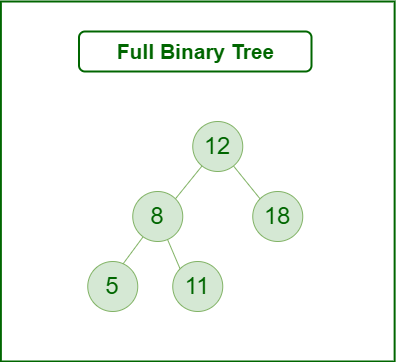

A full binary tree is a [Binary Tree](Binary%20Tree.md) with either zero or two child nodes for each node and does not have any nodes that have only one child node.

## Theorem:
Let T be a non-empty, full binary tree Then:
- If **T** has **I** internal nodes, the number of leaves is $\text{L} = \text{I} + 1$

This is known as the full binary tree theorem.
## Facts Derived form the Theorem:
- If **T** is **I** internal nodes, the total number of nodes is $\text{N} = 2\text{I}+1$
- If **T** has a total of **N** nodes, the number of internal nodes is $\text{I} =\frac{\text{N}-1}{2}$ 
- If **T** has a total of **N** nodes, the number of leaves is $\text{N}=2\text{L}-1$
- If **T** has **L** leaves, the total number of nodes is $\text{N}=2\text{L}-1$
- If **T** has **L** leaves, the number of internal nodes is $\text{I}=\text{L}-1$
## Some Other Properties:
- There are maximum of **2k** nodes in level **k** for every $k\geq 0$
- The binary tree with **λ** levels has maximum of $2^\lambda-1$ nodes.
- The binary tree with **N** nodes has the number of levels at least $[\log(N+1)]$
- The binary tree with **L** leaves has the number of leaves at least $[\log \text{L}]+1$.
