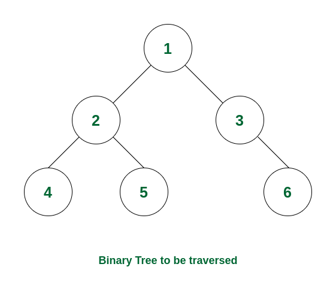

Inorder traversal visits the node in the order: **Left -> Root -> Right**

## Algorithm

>- Traverse the left subtree, i.e., call Inorder (left-> subtree)
>- Visit the root.
>- Traverse the right subtree, i.e., call Inorder (right->subtree) 

## Uses

- In the case of binary search trees (BST), Inorder traversal gives nodes in a non-decreasing order.
- To get nodes of BST in non-increasing order, a variation of Inorder traversal where Inorder traversal is reversed can be used.
- In order traversal can be used to evaluate arithmetic expression stored in expression trees.

