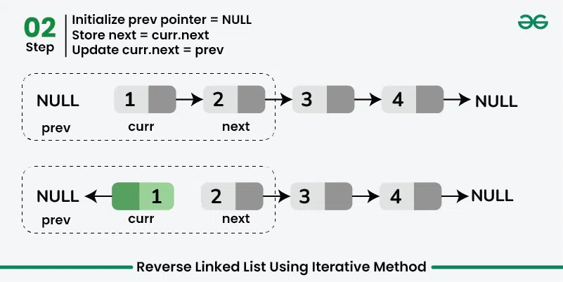
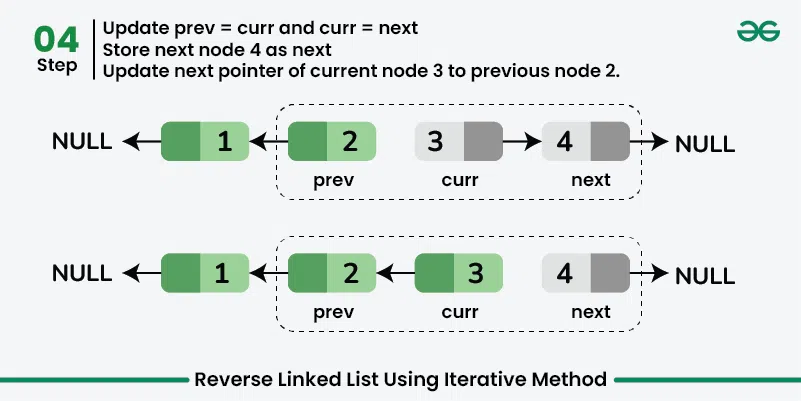
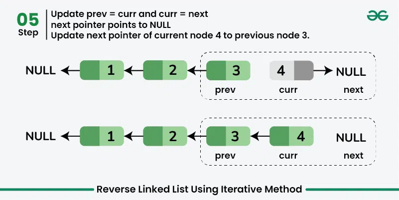
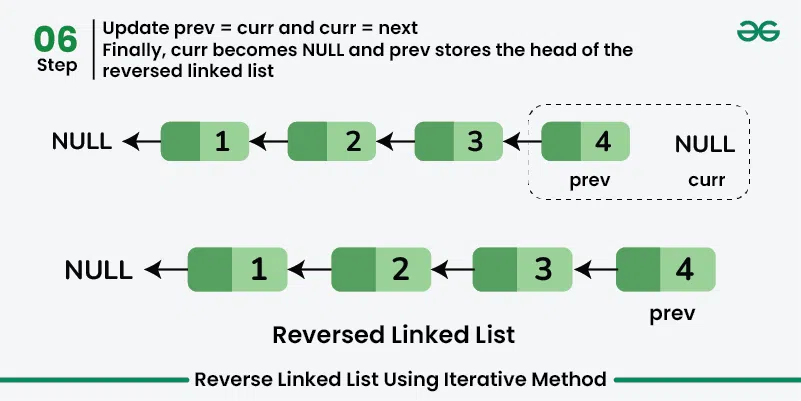

# Reverse a Linked List
Given a linked list, the task is to reverse the linked list by changing the links between nodes.
**Examples:**

> [!info] 
> ***Input***: Linked List = 1 -> 2 -> 3 -> 4 -> NULL   
***Output***: Reversed Linked List = 4 -> 3 -> 2 -> 1 -> NULL
>
***Input***: Linked List = 1 -> 2 -> 3 -> 4 -> 5 -> NULL   
***Output***: Reversed Linked List = 5 -> 4 -> 3 -> 2 -> 1 -> NULL
>
***Input***: Linked List = NULL   
***Output***: Reversed Linked List = NULL
>
***Input***: Linked List = 1->NULL   
***Output***: Reversed Linked List = 1->NULL
### 1. Expected Approach
[**Using Iterative Method -- O(n) Time and O(1) Space:**]

> [!info] 
> The idea is to reverse the links of all nodes using **three** pointers:
> - **prev:** pointer to keep track of the previous node
> - **curr**: pointer to keep track of the current node
> - **next:** pointer to keep track of the next node
> 
> Starting from the first node, initialize **curr** with the head of linked list and **next** with the next node of **curr.** Update the next pointer of curr with **prev.** Finally, move the three pointer by updating **prev** with **curr** and **curr** and **next**.


 


 

Follow the steps below to solve the problem:
- Initialize three pointers **prev** as *NULL*, **curr** as **head**, and **next** as *NULL*. 
- Iterate through the linked list. In a loop, do the following:
	- Store the next node, **next = curr -> next**
	- Update the next pointer of **curr** to **prev**, **curr -> next = prev**
	- Update the prev as curr and curr as next, **prev = curr** and **curr = next**.
Below is the implementation of the above approach:
````tabs

tab: C++
```cpp
// Iterative C++ program to reverse a linked list

#include <iostream>
using namespace std;

class Node {
public:
    int data;
    Node* next;

    Node(int new_data) {
        data = new_data;
        next = nullptr;
    }
};

// Given the head of a list, reverse the list and return the
// head of reversed list
Node* reverseList(Node* head) {
    
      // Initialize three pointers: curr, prev and next
    Node *curr = head, *prev = nullptr, *next;

      // Traverse all the nodes of Linked List
    while (curr != nullptr) {
      
        // Store next
        next = curr->next;
      
        // Reverse current node's next pointer
        curr->next = prev;
      
        // Move pointers one position ahead
        prev = curr;
        curr = next;
    }
      
      // Return the head of reversed linked list
    return prev;
}

void printList(Node* node) {
    while (node != nullptr) {
        cout << " " << node->data;
        node = node->next;
    }
}

int main() {

    // Create a hard-coded linked list:
    // 1 -> 2 -> 3 -> 4 -> 5
    Node* head = new Node(1);
    head->next = new Node(2);
    head->next->next = new Node(3);
    head->next->next->next = new Node(4);
    head->next->next->next->next = new Node(5);

    cout << "Given Linked list:";
    printList(head);

    head = reverseList(head);

    cout << "\nReversed Linked List:";
    printList(head);

    return 0;
}
```
tab: C
```c
// Iterative C program to reverse a linked list

#include <stdio.h>

struct Node {
    int data;
    struct Node* next;
};

// Given the head of a list, reverse the list and return the
// head of reversed list
struct Node* reverseList(struct Node* head) {

    // Initialize three pointers: curr, prev and next
    struct Node *curr = head, *prev = NULL, *next;

    // Traverse all the nodes of Linked List
    while (curr != NULL) {

        // Store next
        next = curr->next;

        // Reverse current node's next pointer
        curr->next = prev;

        // Move pointers one position ahead
        prev = curr;
        curr = next;
    }

    // Return the head of reversed linked list
    return prev;
}

void printList(struct Node* node) {
    while (node != NULL) {
        printf(" %d", node->data);
        node = node->next;
    }
}


struct Node* createNode(int new_data) {
    struct Node* new_node
        = (struct Node*)malloc(sizeof(struct Node));
    new_node->data = new_data;
    new_node->next = NULL;
    return new_node;
}

int main() {

    // Create a hard-coded linked list:
    // 1 -> 2 -> 3 -> 4 -> 5
    struct Node* head = createNode(1);
    head->next = createNode(2);
    head->next->next = createNode(3);
    head->next->next->next = createNode(4);
    head->next->next->next->next = createNode(5);

    printf("Given Linked list:");
    printList(head);

    head = reverseList(head);

    printf("\nReversed Linked List:");
    printList(head);

    return 0;
}
```
tab: Java
```java
// Iterative Java program to reverse a linked list

class Node {
    int data;
    Node next;

    Node(int new_data) {
        data = new_data;
        next = null;
    }
}

// Given the head of a list, reverse the list and return the
// head of reversed list
public class GfG {
     static Node reverseList(Node head) {
        
        // Initialize three pointers: curr, prev and next
        Node curr = head, prev = null, next;

        // Traverse all the nodes of Linked List
        while (curr != null) {
            
            // Store next
            next = curr.next;
            
            // Reverse current node's next pointer
            curr.next = prev;
            
            // Move pointers one position ahead
            prev = curr;
            curr = next;
        }
        
        // Return the head of reversed linked list
        return prev;
    }

    // This function prints the contents
    // of the linked list starting from the head
    static void printList(Node node) {
        while (node != null) {
            System.out.print(" " + node.data);
            node = node.next;
        }
    }

    public static void main(String[] args) {

        // Create a hard-coded linked list:
        // 1 -> 2 -> 3 -> 4 -> 5
        Node head = new Node(1);
        head.next = new Node(2);
        head.next.next = new Node(3);
        head.next.next.next = new Node(4);
        head.next.next.next.next = new Node(5);

        System.out.print("Given Linked list:");
        printList(head);
        
        head = reverseList(head);

        System.out.print("\nReversed Linked List:");
        printList(head);
    }
}
```
tab: Python
```python
# Iterative Python program to reverse a linked list
class Node:
    def __init__(self, new_data):
        self.data = new_data
        self.next = None

# Given the head of a list, reverse the list and return the
# head of reversed list
def reverse_list(head):

    # Initialize three pointers: curr, prev and next
    curr = head
    prev = None

    # Traverse all the nodes of Linked List
    while curr is not None:

        # Store next
        next_node = curr.next

        # Reverse current node's next pointer
        curr.next = prev

        # Move pointers one position ahead
        prev = curr
        curr = next_node

    # Return the head of reversed linked list
    return prev

def print_list(node):
    while node is not None:
        print(f" {node.data}", end="")
        node = node.next
    print()

if __name__ == "__main__":

    # Create a hard-coded linked list:
    # 1 -> 2 -> 3 -> 4 -> 5
    head = Node(1)
    head.next = Node(2)
    head.next.next = Node(3)
    head.next.next.next = Node(4)
    head.next.next.next.next = Node(5)

    print("Given Linked list:", end="")
    print_list(head)

    head = reverse_list(head)

    print("Reversed Linked List:", end="")
    print_list(head)
```
tab: Javascript
```javascript
// Iterative JavaScript program to reverse a linked list

class Node {
    constructor(newData) {
        this.data = newData;
        this.next = null;
    }
}

// Given the head of a list, reverse the list and return the
// head of reversed list
function reverseList(head) {

    // Initialize three pointers: curr, prev and next
    let curr = head;
    let prev = null;
    let next;

    // Traverse all the nodes of Linked List
    while (curr !== null) {
        // Store next
        next = curr.next;

        // Reverse current node's next pointer
        curr.next = prev;

        // Move pointers one position ahead
        prev = curr;
        curr = next;
    }

    // Return the head of reversed linked list
    return prev;
}

function printList(node) {
    while (node !== null) {
        console.log(" " + node.data);
        node = node.next;
    }
    console.log();
}

// Create a hard-coded linked list:
// 1 -> 2 -> 3 -> 4 -> 5
let head = new Node(1);
head.next = new Node(2);
head.next.next = new Node(3);
head.next.next.next = new Node(4);
head.next.next.next.next = new Node(5);

console.log("Given Linked list:");
printList(head);

head = reverseList(head);

console.log("Reversed Linked List:");
printList(head);
```
tab: C#
```csharp
// Iterative JavaScript program to reverse a linked list

class Node {
    constructor(newData) {
        this.data = newData;
        this.next = null;
    }
}

// Given the head of a list, reverse the list and return the
// head of reversed list
function reverseList(head) {

    // Initialize three pointers: curr, prev and next
    let curr = head;
    let prev = null;
    let next;

    // Traverse all the nodes of Linked List
    while (curr !== null) {
        // Store next
        next = curr.next;

        // Reverse current node's next pointer
        curr.next = prev;

        // Move pointers one position ahead
        prev = curr;
        curr = next;
    }

    // Return the head of reversed linked list
    return prev;
}

function printList(node) {
    while (node !== null) {
        console.log(" " + node.data);
        node = node.next;
    }
    console.log();
}

// Create a hard-coded linked list:
// 1 -> 2 -> 3 -> 4 -> 5
let head = new Node(1);
head.next = new Node(2);
head.next.next = new Node(3);
head.next.next.next = new Node(4);
head.next.next.next.next = new Node(5);

console.log("Given Linked list:");
printList(head);

head = reverseList(head);

console.log("Reversed Linked List:");
printList(head);

```
````
**Output:**
```
Given Linked list: 1 2 3 4 5
Reversed Linked List: 5 4 3 2 1
```
**Time Complexity:** O(n), Traversing over the linked list of size *n*.
**Auxiliary Space:** O(1)


