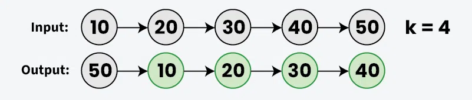
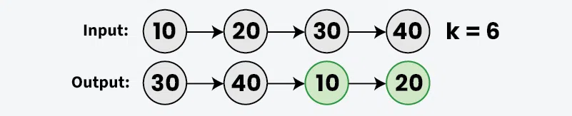
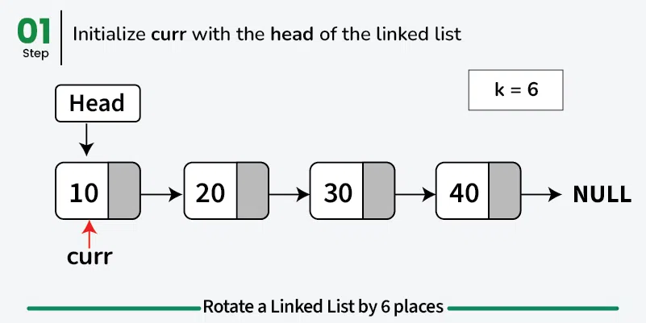
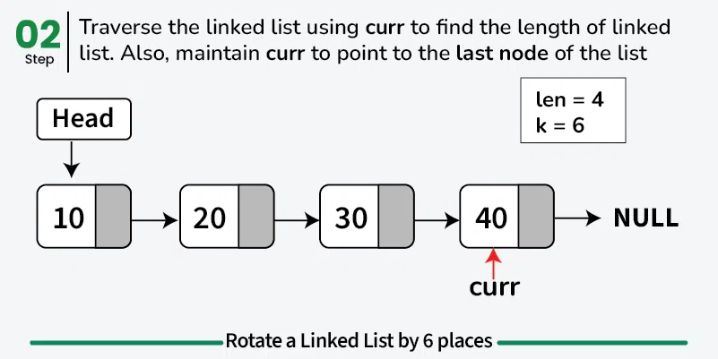
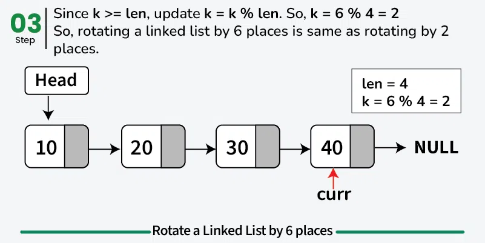
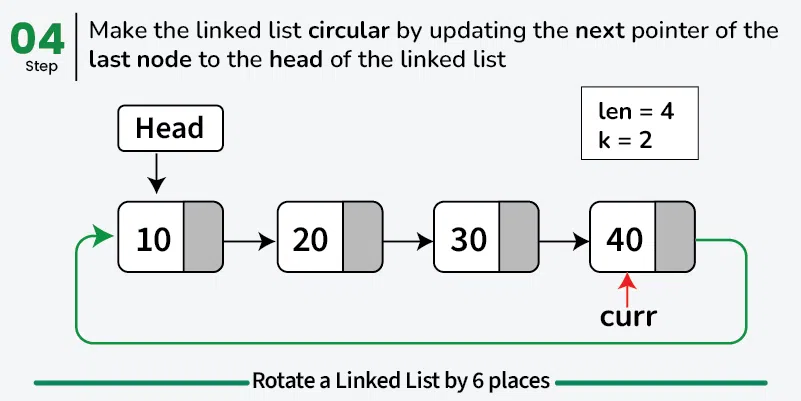
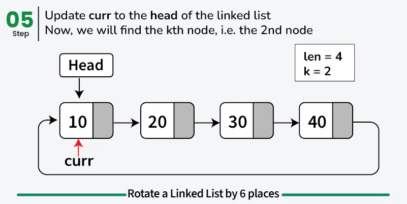
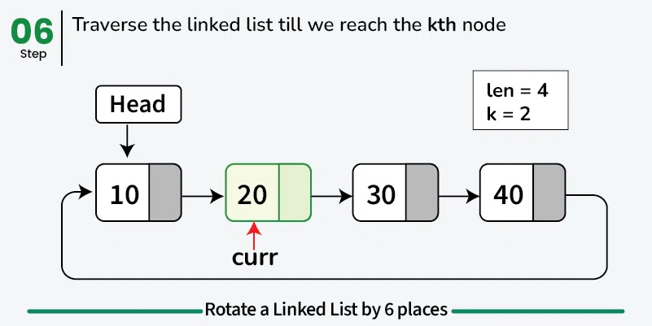
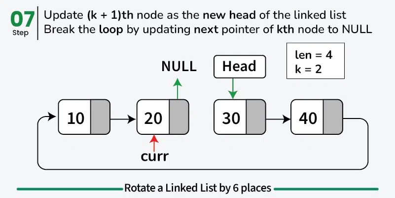

Given a singly linked list and an integer k, the task is to rotate the linked list to the left by **k** places.

**Example:-**

> [!info] Title
> **input:** linked list = $10\to 20\to 30\to{4}0\to{5}0, k=4$
> **Output:** $50\to 10\to 20\to 30\to 40$
> 
> **Explanation:** After rotating the linked list to the left by 4 places, the **5th** node, i.e node **50** becomes the head of linked list and next pointer of node **50** points to node **10**.
> 
> **Input:** linked List = $10\to 20\to 30\to 40, k=6$
> **Output:** $30\to 40\to 10\to 20$
> 
> **Explanation:** After rotating the linked list to the left by 6 places (same as rotating by 2 places as (k % len) = (6 % 4 = 2)), the **3rd** node, i.e node **30** becomes the head of the linked list and next pointer of node **40** points to node **10**.

## Native Approach
#### Shifting head node to the end k times

> [!note] Title
> To rotate a linked list to the **left k places,** we can repeatedly move the **head node to the end** of the linked list k times.
````tabs

tab: C++
```cpp
// C++ program to rotate a linked list by
// changing moving first node to end k times

#include <iostream>
using namespace std;

class Node {
  public:
    int data;
    Node *next;
    Node(int new_data) {
        data = new_data;
        next = nullptr;
    }
};

// Function to rotate the linked list
// left by k nodes
Node *rotate(Node *head, int k) {
    if (k == 0 || head == nullptr)
        return head;

    // Rotate the list by k nodes
    for (int i = 0; i < k; ++i) {
        Node *curr = head;
        while (curr->next != nullptr)
            curr = curr->next;
        
        // Move the first node to the last
        curr->next = head;
        curr = curr->next;
        head = head->next;
        curr->next = nullptr;
    }
    return head;
}

void printList(Node *node) {
    while (node != nullptr) {
        cout << node->data << " ";
        node = node->next;
    }
    cout << endl;
}

int main() {

    // Create a hard-coded linked list:
    // 10 -> 20 -> 30 -> 40
    Node *head = new Node(10);
    head->next = new Node(20);
    head->next->next = new Node(30);
    head->next->next->next = new Node(40);
  
    head = rotate(head, 6);
    printList(head);

    return 0;
}
```
tab: C
```c
// C program to rotate a linked list
// by changing moving first node to end k times.

#include <stdio.h>
#include <stdlib.h>

// A linked list node
struct Node {
    int data;
    struct Node* next;
};

// Function to create a new node
struct Node* createNode(int new_data) {
    struct Node* new_node = 
       (struct Node*)malloc(sizeof(struct Node));
    new_node->data = new_data;
    new_node->next = NULL;
    return new_node;
}

// Function to rotate the linked list
// left by k nodes
struct Node* rotate(struct Node *head, int k) {
    if (k == 0 || head == NULL)
        return head;

    // Rotate the list by k nodes
    for (int i = 0; i < k; ++i) {
        struct Node *curr = head;
        while (curr->next != NULL)
            curr = curr->next;

        // Move the first node to the last
        curr->next = head;
        curr = curr->next;
        head = head->next;
        curr->next = NULL;
    }
    return head;
}

void printList(struct Node *node) {
    while (node != NULL) {
        printf("%d ", node->data);
        node = node->next;
    }
    printf("\n");
}

int main() {
  
    // Create a hard-coded linked list:
    // 10 -> 20 -> 30 -> 40
    struct Node *head = createNode(10);
    head->next = createNode(20);
    head->next->next = createNode(30);
    head->next->next->next = createNode(40);
  
    head = rotate(head, 6);
    printList(head);

    return 0;
}
```
tab: Java
```java
// Java program to rotate a linked list
// by changing moving first node to end k times.

class Node {
    int data;
    Node next;

    Node(int new_data) {
        data = new_data;
        next = null;
    }
}

class GfG {

    // Function to rotate the linked list
    // left by k nodes
    static Node rotate(Node head, int k) {
        if (k == 0 || head == null)
            return head;

        // Rotate the list by k nodes
        for (int i = 0; i < k; ++i) {
            Node curr = head;
            while (curr.next != null)
                curr = curr.next;

            // Move the first node to the last
            curr.next = head;
            curr = curr.next;
            head = head.next;
            curr.next = null;
        }
        return head;
    }

    static void printList(Node node) {
        while (node != null) {
            System.out.print(node.data + " ");
            node = node.next;
        }
        System.out.println();
    }

    public static void main(String[] args) {
          
        // Create a hard-coded linked list:
        // 10 -> 20 -> 30 -> 40
        Node head = new Node(10);
        head.next = new Node(20);
        head.next.next = new Node(30);
        head.next.next.next = new Node(40);

        head = rotate(head, 6);
        printList(head);
    }
}
```
tab: Python
```python
# Python program to rotate a linked list
# by changing moving first node to end k times.

class Node:
    def __init__(self, new_data):
        self.data = new_data
        self.next = None

# Function to rotate the linked list
# left by k nodes
def rotate(head, k):
    if k == 0 or head is None:
        return head

    # Rotate the list by k nodes
    for _ in range(k):
        curr = head
        while curr.next is not None:
            curr = curr.next
        
        # Move the first node to the last
        curr.next = head
        curr = curr.next
        head = head.next
        curr.next = None
    
    return head

def printList(node):
    while node is not None:
        print(node.data, end=" ")
        node = node.next
    print()

if __name__ == "__main__":
  
    # Create a hard-coded linked list:
    # 10 -> 20 -> 30 -> 40
    head = Node(10)
    head.next = Node(20)
    head.next.next = Node(30)
    head.next.next.next = Node(40)

    head = rotate(head, 6)
    printList(head)
```
tab: Javascript
```javascript
// Javascript program to rotate a linked list
// by changing moving first node to end k times.

class Node {
    constructor(new_data) {
        this.data = new_data;
        this.next = null;
    }
}

// Function to rotate the linked list
// left by k nodes
function rotate(head, k) {
    if (k === 0 || head === null) {
        return head;
    }

    // Rotate the list by k nodes
    for (let i = 0; i < k; ++i) {
        let curr = head;
        while (curr.next !== null) {
            curr = curr.next;
        }

        // Move the first node to the last
        curr.next = head;
        curr = curr.next;
        head = head.next;
        curr.next = null;
    }
    return head;
}

function printList(node) {
    let result = '';
    while (node !== null) {
        result += node.data + ' ';
        node = node.next;
    }
    console.log(result.trim());
}

// Create a hard-coded linked list:
// 10 -> 20 -> 30 -> 40
let head = new Node(10);
head.next = new Node(20);
head.next.next = new Node(30);
head.next.next.next = new Node(40);

head = rotate(head, 6);
printList(head);
```
tab: C#
```csharp
// C# program to rotate a linked list
// by changing moving first node to end k times

using System;

class Node {
    public int data;
    public Node next;
    
    public Node(int new_data) {
        data = new_data;
        next = null;
    }
}

// Function to rotate the linked list
// left by k nodes
class GfG {
    static Node Rotate(Node head, int k) {
        if (k == 0 || head == null)
            return head;

        // Rotate the list by k nodes
        for (int i = 0; i < k; ++i) {
            Node curr = head;
            while (curr.next != null)
                curr = curr.next;
            
            // Move the first node to the last
            curr.next = head;
            curr = curr.next;
            head = head.next;
            curr.next = null;
        }
        return head;
    }

    static void PrintList(Node node) {
        while (node != null) {
            Console.Write(node.data + " ");
            node = node.next;
        }
        Console.WriteLine();
    }

    static void Main() {
          
        // Create a hard-coded linked list:
        // 10 -> 20 -> 30 -> 40
        Node head = new Node(10);
        head.next = new Node(20);
        head.next.next = new Node(30);
        head.next.next.next = new Node(40);

        head = Rotate(head, 6);
        PrintList(head);
    }
}
```
````
**Output**
```
30 40 50 10 20
```
**Time Complexity:** $\text{O(n*k),}$ where n is the number of nodes in Linked list and k is the number of rotations.
**Auxiliary Space:** O(1)
# Expected Approach
#### By Changing pointer of $k^{th}$ node

> [!note] Approach
> The idea is to first convert linked list to [Circular Linked List](../Circular%20Linked%20List/Circular%20Linked%20List.md) by updating the next pointer of last node to the head of linked list. Then traverse to the **kth** node and update the head of the linked list to the **(k+1) th** node. Finally, break the loop by updating the **next pointer of kth node** to **NULL**.
##### How to Handle Large Values of k?
For a list of size **n**, if we rotate the linked list to the left by n places, then linked list will remain **unchanged** and if we rotate the list to the left by **(n+1)** palces, then it is same as rotating the linked list to the left by **1 place.** Similarly, if we rotate the linked list k (k>=n) places to the left, then it is same as rotating the linked list by **(k % n)** places. So, we can simply update k with **k % n** to handle large values of **k**.
      
````tabs

tab: C++
```cpp
// C++ program to rotate a linked list
// by changing pointer of kth node

#include <iostream>
using namespace std;

class Node {
  public:
    int data;
    Node *next;

    Node(int new_data) {
        data = new_data;
        next = nullptr;
    }
};

// Function to rotate the linked list
// to the left by k places
Node *rotate(Node *head, int k) {

    // If the linked list is empty or no rotations are
    // needed, then return the original linked list
    if (k == 0 || head == nullptr)
        return head;

    Node *curr = head;
    int len = 1;
  
      // Find the length of linked list
    while (curr->next != nullptr) {
        curr = curr->next;
        len += 1;
    }

      // Modulo k with length of linked list to handle
      // large values of k
    k %= len;
  
    if (k == 0)
        return head;
  
      // Make the linked list circular
    curr->next = head;

      // Traverse the linked list to find the kth node
    curr = head;
    for (int i = 1; i < k; i++)
        curr = curr->next;

      // Update the (k + 1)th node as the new head
    head = curr->next;
  
      // Break the loop by updating next pointer of kth node
    curr->next = nullptr;
    return head;
}

void printList(Node *node) {
    while (node != nullptr) {
        cout << node->data << " ";
        node = node->next;
    }
    cout << endl;
}

int main() {

    // Create a hard-coded linked list:
    // 10 -> 20 -> 30 -> 40
    Node *head = new Node(10);
    head->next = new Node(20);
    head->next->next = new Node(30);
    head->next->next->next = new Node(40);
  
    head = rotate(head, 6);
    printList(head);
    return 0;
}
```
tab: C
```c
// C program to rotate a linked list
// by changing pointer of kth node

#include <stdio.h>

struct Node {
    int data;
    struct Node *next;
};

// Function to create a new node
struct Node* createNode(int new_data) {
    struct Node *new_node = 
                  (struct Node*)malloc(sizeof(struct Node));
    new_node->data = new_data;
    new_node->next = NULL;
    return new_node;
}

// Function to rotate the linked list
// to the left by k places
struct Node* rotate(struct Node *head, int k) {
  
    // If the linked list is empty or no rotations are
    // needed, then return the original linked list
    if (k == 0 || head == NULL)
        return head;

    struct Node *curr = head;
    int len = 1;

    // Find the length of linked list
    while (curr->next != NULL) {
        curr = curr->next;
        len += 1;
    }

    // Modulo k with length of linked list to handle
    // large values of k
    k %= len;

    if (k == 0)
        return head;
  
      // Make the linked list circular
    curr->next = head;

    // Traverse the linked list to find the kth node
    curr = head;
    for (int i = 1; i < k; i++)
        curr = curr->next;

    // Update the (k + 1)th node as the new head
    head = curr->next;

    // Break the loop by updating next pointer of kth node
    curr->next = NULL;
    return head;
}

void printList(struct Node *node) {
    while (node != NULL) {
        printf("%d ", node->data);
        node = node->next;
    }
    printf("\n");
}

int main() {
      
    // Create a hard-coded linked list:
    // 10 -> 20 -> 30 -> 40
    struct Node *head = createNode(10);
    head->next = createNode(20);
    head->next->next = createNode(30);
    head->next->next->next = createNode(40);

    head = rotate(head, 6);
    printList(head);
    return 0;
}
```
tab: Java
```java
// Java program to rotate a linked list
// by changing pointer of kth node

class Node {
    int data;
    Node next;

    Node(int new_data) {
        data = new_data;
        next = null;
    }
}

// Function to rotate the linked list
// to the left by k places
class GfG {
    static Node rotate(Node head, int k) {

        // If the linked list is empty or no rotations are
        // needed, then return the original linked list
        if (k == 0 || head == null)
            return head;

        Node curr = head;
        int len = 1;
      
        // Find the length of linked list
        while (curr.next != null) {
            curr = curr.next;
            len += 1;
        }

        // Modulo k with length of linked list to handle
        // large values of k
        k %= len;
      
        if (k == 0)
            return head;
      
          // Make the linked list circular
        curr.next = head;

        // Traverse the linked list to find the kth node
        curr = head;
        for (int i = 1; i < k; i++)
            curr = curr.next;

        // Update the (k + 1)th node as the new head
        head = curr.next;
      
        // Break the loop by updating next pointer of kth node
        curr.next = null;
        return head;
    }

    static void printList(Node node) {
        while (node != null) {
            System.out.print(node.data + " ");
            node = node.next;
        }
        System.out.println();
    }

    public static void main(String[] args) {

        // Create a hard-coded linked list:
        // 10 -> 20 -> 30 -> 40
        Node head = new Node(10);
        head.next = new Node(20);
        head.next.next = new Node(30);
        head.next.next.next = new Node(40);
      
        head = rotate(head, 6);
        printList(head);
    }
}
```
tab: Python
```python
# Python program to rotate a linked list
# by changing pointer of kth node

class Node:
    def __init__(self, new_data):
        self.data = new_data
        self.next = None

# Function to rotate the linked list
# to the left by k places
def rotate(head, k):

    # If the linked list is empty or no rotations are
    # needed, then return the original linked list
    if k == 0 or head is None:
        return head

    curr = head
    length = 1

    # Find the length of linked list
    while curr.next is not None:
        curr = curr.next
        length += 1

    # Modulo k with length of linked list to handle
    # large values of k
    k %= length

    if k == 0:
        curr.next = None
        return head
      
    # Make the linked list circular
    curr.next = head

    # Traverse the linked list to find the kth node
    curr = head
    for _ in range(1, k):
        curr = curr.next

    # Update the (k + 1)th node as the new head
    new_head = curr.next

    # Break the loop by updating next pointer of kth node
    curr.next = None
    return new_head

def print_list(node):
    while node is not None:
        print(node.data, end=" ")
        node = node.next
    print()

if __name__ == "__main__":

    # Create a hard-coded linked list:
    # 10 -> 20 -> 30 -> 40
    head = Node(10)
    head.next = Node(20)
    head.next.next = Node(30)
    head.next.next.next = Node(40)

    head = rotate(head, 6)
    print_list(head)
```
tab: Javascript
```javascript
// JavaScript program to rotate a linked list
// by changing pointer of kth node

class Node {
    constructor(new_data) {
        this.data = new_data;
        this.next = null;
    }
}

// Function to rotate the linked list
// to the left by k places
function rotate(head, k) {

    // If the linked list is empty or no rotations are
    // needed, then return the original linked list
    if (k === 0 || head === null)
        return head;

    let curr = head;
    let len = 1;

    // Find the length of linked list
    while (curr.next !== null) {
        curr = curr.next;
        len += 1;
    }

    // Modulo k with length of linked list to handle
    // large values of k
    k %= len;

    if (k === 0) {
        curr.next = null;
        return head;
    }
    
    // Make the linked list circular
    curr.next = head;

    // Traverse the linked list to find the kth node
    curr = head;
    for (let i = 1; i < k; i++)
        curr = curr.next;

    // Update the (k + 1)th node as the new head
    let newHead = curr.next;

    // Break the loop by updating next pointer of kth node
    curr.next = null;
    return newHead;
}

function printList(node) {
    let output = '';
    while (node !== null) {
        output += node.data + ' ';
        node = node.next;
    }
    console.log(output.trim());
}

// Create a hard-coded linked list:
// 10 -> 20 -> 30 -> 40
let head = new Node(10);
head.next = new Node(20);
head.next.next = new Node(30);
head.next.next.next = new Node(40);

head = rotate(head, 6);
printList(head);
```
tab: C#
```csharp
// C program to rotate a linked list
// by changing pointer of kth node

using System;

public class Node {
    public int data;
    public Node next;

    public Node(int new_data) {
        data = new_data;
        next = null;
    }
}

// Function to rotate the linked list
// to the left by k places
class GfG {

    static Node Rotate(Node head, int k) {

        // If the linked list is empty or no rotations are
        // needed, then return the original linked list
        if (k == 0 || head == null)
            return head;

        Node curr = head;
        int len = 1;
      
        // Find the length of linked list
        while (curr.next != null) {
            curr = curr.next;
            len += 1;
        }

        // Modulo k with length of linked list to handle
        // large values of k
        k %= len;
      
        if (k == 0) 
            return head;
      
          // Make the linked list circular
        curr.next = head;

        // Traverse the linked list to find the kth node
        curr = head;
        for (int i = 1; i < k; i++)
            curr = curr.next;

        // Update the (k + 1)th node as the new head
        Node newHead = curr.next;
      
        // Break the loop by updating next pointer of kth node
        curr.next = null;
        return newHead;
    }

    static void PrintList(Node node) {
        while (node != null) {
            Console.Write(node.data + " ");
            node = node.next;
        }
        Console.WriteLine();
    }

    public static void Main() {

        // Create a hard-coded linked list:
        // 10 -> 20 -> 30 -> 40
        Node head = new Node(10);
        head.next = new Node(20);
        head.next.next = new Node(30);
        head.next.next.next = new Node(40);
      
        head = Rotate(head, 6);
        PrintList(head);
    }
}
```
````
**Output:**
```
30 40 10 20
```
**Time Complexity:** O(n), where **n** is the number of nodes in linked list.
**Auxiliary Space:** O(1)