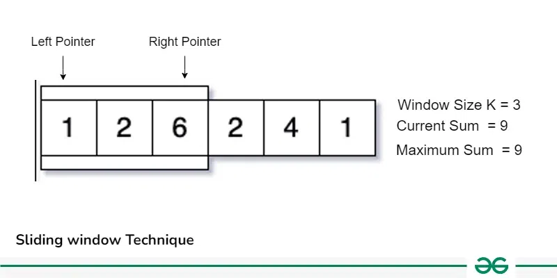
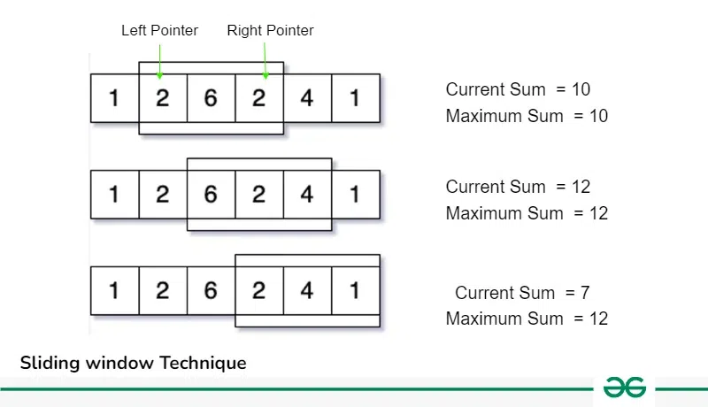

**Sliding Window Technique** is a method used to efficiently solve problems that involve defining a **window** or **range** in the input data (arrays or strings) and then moving that window across the data to perform some operation within the window.
This technique is commonly used in algorithms like finding **subarrays with a specific sum**, **finding the longest substring with unique characters**, or solving problems that require a fixed size window to process elements efficiently.

.webp)

Lets take an example to understand this properly, say we have an array or size **N** and also an integer **K**. Now, we have to calculate the maximum sum of a subarray having size exactly **K**. Now how should we approach this problem?

One way to do this by taking each subarray of size **K** from the array and find out the maximum sum of these subarrays. This can be done using Nested loops which will result into $\text{O(N}^2\text{)}$ Time Complexity.

**But can we optimize this approach?**
The answer is Yes, Instead of taking each **K** sized subarray and calculating its sum, we can just take one **K** sized subarray from 0 to K-1 index and calculate its sum now shift our range one by one along with the iterations and update the result, like in next iteration increase the left and right pointer and update the previous sum as shown in the below image: 

Now follow this method for each iteration till we reach the end of the array:

So, we can see that instead of recalculating the sum of each K sized subarray we are using previous window of size k and using its results we update the sum and shift the window right by moving left and right pointers, this operation is optimal because it take O(1) time to shift the range instead of recalculating.

This approach of shifting the pointers and calculating the results accordingly is know as **Sliding window Technique**.
## How to use Sliding Window Technique
1. **Fixed Size Sliding Window**
	- Find the size of the window required, say K.
	- Compute the result for 1st window, i.e. include the first K elements of the data structure.
	- Then use a loop to slide the window by 1 and keep computing the result window by window.
2. **Variable Size Sliding Window:**
	- In this type of sliding window problem, we increase out right pointer one by one till our condition is true.
	- At any step if our condition does not match, we shrink the size of our window by increasing left pointer.
	- Again, when our condition satisfies, we start increasing the right pointer and follow step 1.
	- We follow these steps until we reach to the end of the array.
## How to identify Sliding Window Problems:
- These problems generally require Finding Maximum/Minimum **Subarray, Substrings** which satisfy some specific condition.
- The size of the subarray or substring **'K'** will be given on some of the problems.
- These problems can easily be solved in $O(N^2)$ time complexity using nested loops, using sliding window we can solve these in $O(N)$ Time Complexity.
- Required Time Complexity: $O(N)$ or $O(N\log(N))$
- Constraints: $N\leq 10^6$, If N is the size of Array/String.