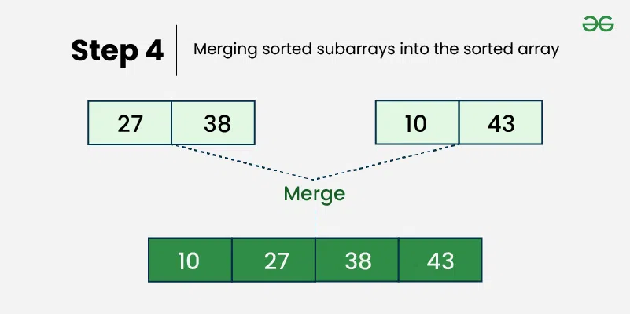

---
tags:
  - DSA
  - Sorting
---
**Merge Sort** is a [Sorting Algorithms](../Sorting%20Algorithms.md) that follows the **divide and conquer** approach. It works by recursively dividing the input array into the smaller subarray and sorting those subarrays then merging them back together to obtain the sorted array.

In simple terms, we can say that the process of **merge sort** is to divide the array into two halves, sort each half, and then merge the sorted halves back together. This process is repeated until the entire array is sorted.


#### Table of Content

- [How does Merge Sort work?](#How%20does%20Merge%20Sort%20work?)
- 
## How does Merge Sort work?
Merge sort is a popular [Sorting Algorithms](../Sorting%20Algorithms.md) known for its efficiency and stability. It follows the **divide-and-conquer** approach to sort a given array of elements.

Here's a step-by-step explanation of how merge sort works:
- **Divide:** Divide the list or array recursively into two halves until it can no more de divided.
- **Conquer:** Each subarray is sorted individually using the merge sort algorithm.
- **Merge:** The sorted subarrays are merged together in sorted order. The process continues until all elements from both subarrays have been merged.

## Illustration of Merge Sort:
Let's sort the array or list **[38, 27, 43, 10]** using Merge Sort:




> [!note] Lets look at the working of above example
> **Divide:**
>- **[38, 27, 43, 10]** is divided into **[38, 27]** and **[43, 10]**
>- **[38, 27]** is divided into **[38, 27]**.
>- **[43, 10]** is divided into **[43]** and **[10]**.
>
>**Conquer:**
> - **[38]** is already sorted.
> - **[27]** is already sorted.
> - **[43]** is already sorted.
> - **[10]** is already sorted.
> 
> **Merge:**
>- Merge **[38]** and **[27]** to get **[27, 38]**.
>- Merge **[43]** and **[10]** to get **[10, 43]**.
>- Merge **[27, 38]** and **[10, 43]** to get the final sorted list **[10, 27, 38, 43]**.
>
>Therefore, the sorted list is **[10, 27, 38, 43]**.

**Merge sort** is one of most optimized and **most used [Sorting Algorithms](../Sorting%20Algorithms.md)** in the industry but there more [Sorting Algorithms](../Sorting%20Algorithms.md) that are more optimized in different cases.
## Implementation
````tabs

tab: C++
```cpp
#include <bits/stdc++.h>
using namespace std;

// Merges two subarrays of arr[].
// First subarray is arr[left..mid]
// Second subarray is arr[mid+1..right]
void merge(vector<int>& arr, int left, 
                     int mid, int right)
{
    int n1 = mid - left + 1;
    int n2 = right - mid;

    // Create temp vectors
    vector<int> L(n1), R(n2);

    // Copy data to temp vectors L[] and R[]
    for (int i = 0; i < n1; i++)
        L[i] = arr[left + i];
    for (int j = 0; j < n2; j++)
        R[j] = arr[mid + 1 + j];

    int i = 0, j = 0;
    int k = left;

    // Merge the temp vectors back 
    // into arr[left..right]
    while (i < n1 && j < n2) {
        if (L[i] <= R[j]) {
            arr[k] = L[i];
            i++;
        }
        else {
            arr[k] = R[j];
            j++;
        }
        k++;
    }

    // Copy the remaining elements of L[], 
    // if there are any
    while (i < n1) {
        arr[k] = L[i];
        i++;
        k++;
    }

    // Copy the remaining elements of R[], 
    // if there are any
    while (j < n2) {
        arr[k] = R[j];
        j++;
        k++;
    }
}

// begin is for left index and end is right index
// of the sub-array of arr to be sorted
void mergeSort(vector<int>& arr, int left, int right)
{
    if (left >= right)
        return;

    int mid = left + (right - left) / 2;
    mergeSort(arr, left, mid);
    mergeSort(arr, mid + 1, right);
    merge(arr, left, mid, right);
}

// Function to print a vector
void printVector(vector<int>& arr)
{
    for (int i = 0; i < arr.size(); i++)
        cout << arr[i] << " ";
    cout << endl;
}

// Driver code
int main()
{
    vector<int> arr = { 12, 11, 13, 5, 6, 7 };
    int n = arr.size();

    cout << "Given vector is \n";
    printVector(arr);

    mergeSort(arr, 0, n - 1);

    cout << "\nSorted vector is \n";
    printVector(arr);
    return 0;
}
```
tab: C
```c
// C program for Merge Sort
#include <stdio.h>
#include <stdlib.h>

// Merges two subarrays of arr[].
// First subarray is arr[l..m]
// Second subarray is arr[m+1..r]
void merge(int arr[], int l, int m, int r)
{
    int i, j, k;
    int n1 = m - l + 1;
    int n2 = r - m;

    // Create temp arrays
    int L[n1], R[n2];

    // Copy data to temp arrays L[] and R[]
    for (i = 0; i < n1; i++)
        L[i] = arr[l + i];
    for (j = 0; j < n2; j++)
        R[j] = arr[m + 1 + j];

    // Merge the temp arrays back into arr[l..r
    i = 0;
    j = 0;
    k = l;
    while (i < n1 && j < n2) {
        if (L[i] <= R[j]) {
            arr[k] = L[i];
            i++;
        }
        else {
            arr[k] = R[j];
            j++;
        }
        k++;
    }

    // Copy the remaining elements of L[],
    // if there are any
    while (i < n1) {
        arr[k] = L[i];
        i++;
        k++;
    }

    // Copy the remaining elements of R[],
    // if there are any
    while (j < n2) {
        arr[k] = R[j];
        j++;
        k++;
    }
}

// l is for left index and r is right index of the
// sub-array of arr to be sorted
void mergeSort(int arr[], int l, int r)
{
    if (l < r) {
        int m = l + (r - l) / 2;

        // Sort first and second halves
        mergeSort(arr, l, m);
        mergeSort(arr, m + 1, r);

        merge(arr, l, m, r);
    }
}

// Function to print an array
void printArray(int A[], int size)
{
    int i;
    for (i = 0; i < size; i++)
        printf("%d ", A[i]);
    printf("\n");
}

// Driver code
int main()
{
    int arr[] = { 12, 11, 13, 5, 6, 7 };
    int arr_size = sizeof(arr) / sizeof(arr[0]);

    printf("Given array is \n");
    printArray(arr, arr_size);

    mergeSort(arr, 0, arr_size - 1);

    printf("\nSorted array is \n");
    printArray(arr, arr_size);
    return 0;
}
```
tab: Java
```java
// Java program for Merge Sort
import java.io.*;

class GfG {

    // Merges two subarrays of arr[].
    // First subarray is arr[l..m]
    // Second subarray is arr[m+1..r]
    static void merge(int arr[], int l, int m, int r)
    {
        // Find sizes of two subarrays to be merged
        int n1 = m - l + 1;
        int n2 = r - m;

        // Create temp arrays
        int L[] = new int[n1];
        int R[] = new int[n2];

        // Copy data to temp arrays
        for (int i = 0; i < n1; ++i)
            L[i] = arr[l + i];
        for (int j = 0; j < n2; ++j)
            R[j] = arr[m + 1 + j];

        // Merge the temp arrays

        // Initial indices of first and second subarrays
        int i = 0, j = 0;

        // Initial index of merged subarray array
        int k = l;
        while (i < n1 && j < n2) {
            if (L[i] <= R[j]) {
                arr[k] = L[i];
                i++;
            }
            else {
                arr[k] = R[j];
                j++;
            }
            k++;
        }

        // Copy remaining elements of L[] if any
        while (i < n1) {
            arr[k] = L[i];
            i++;
            k++;
        }

        // Copy remaining elements of R[] if any
        while (j < n2) {
            arr[k] = R[j];
            j++;
            k++;
        }
    }

    // Main function that sorts arr[l..r] using
    // merge()
    static void sort(int arr[], int l, int r)
    {
        if (l < r) {

            // Find the middle point
            int m = l + (r - l) / 2;

            // Sort first and second halves
            sort(arr, l, m);
            sort(arr, m + 1, r);

            // Merge the sorted halves
            merge(arr, l, m, r);
        }
    }

    // A utility function to print array of size n
    static void printArray(int arr[])
    {
        int n = arr.length;
        for (int i = 0; i < n; ++i)
            System.out.print(arr[i] + " ");
        System.out.println();
    }

    // Driver code
    public static void main(String args[])
    {
        int arr[] = { 12, 11, 13, 5, 6, 7 };

        System.out.println("Given array is");
        printArray(arr);

        sort(arr, 0, arr.length - 1);

        System.out.println("\nSorted array is");
        printArray(arr);
    }
}
```
tab: Python
```python
def merge(arr, left, mid, right):
    n1 = mid - left + 1
    n2 = right - mid

    # Create temp arrays
    L = [0] * n1
    R = [0] * n2

    # Copy data to temp arrays L[] and R[]
    for i in range(n1):
        L[i] = arr[left + i]
    for j in range(n2):
        R[j] = arr[mid + 1 + j]

    i = 0  # Initial index of first subarray
    j = 0  # Initial index of second subarray
    k = left  # Initial index of merged subarray

    # Merge the temp arrays back
    # into arr[left..right]
    while i < n1 and j < n2:
        if L[i] <= R[j]:
            arr[k] = L[i]
            i += 1
        else:
            arr[k] = R[j]
            j += 1
        k += 1

    # Copy the remaining elements of L[],
    # if there are any
    while i < n1:
        arr[k] = L[i]
        i += 1
        k += 1

    # Copy the remaining elements of R[], 
    # if there are any
    while j < n2:
        arr[k] = R[j]
        j += 1
        k += 1

def merge_sort(arr, left, right):
    if left < right:
        mid = (left + right) // 2

        merge_sort(arr, left, mid)
        merge_sort(arr, mid + 1, right)
        merge(arr, left, mid, right)

def print_list(arr):
    for i in arr:
        print(i, end=" ")
    print()

# Driver code
if __name__ == "__main__":
    arr = [12, 11, 13, 5, 6, 7]
    print("Given array is")
    print_list(arr)

    merge_sort(arr, 0, len(arr) - 1)

    print("\nSorted array is")
    print_list(arr)
```
tab: Javascript
```javascript
function merge(arr, left, mid, right) {
    const n1 = mid - left + 1;
    const n2 = right - mid;

    // Create temp arrays
    const L = new Array(n1);
    const R = new Array(n2);

    // Copy data to temp arrays L[] and R[]
    for (let i = 0; i < n1; i++)
        L[i] = arr[left + i];
    for (let j = 0; j < n2; j++)
        R[j] = arr[mid + 1 + j];

    let i = 0, j = 0;
    let k = left;

    // Merge the temp arrays back into arr[left..right]
    while (i < n1 && j < n2) {
        if (L[i] <= R[j]) {
            arr[k] = L[i];
            i++;
        } else {
            arr[k] = R[j];
            j++;
        }
        k++;
    }

    // Copy the remaining elements of L[], if there are any
    while (i < n1) {
        arr[k] = L[i];
        i++;
        k++;
    }

    // Copy the remaining elements of R[], if there are any
    while (j < n2) {
        arr[k] = R[j];
        j++;
        k++;
    }
}

function mergeSort(arr, left, right) {
    if (left >= right)
        return;

    const mid = Math.floor(left + (right - left) / 2);
    mergeSort(arr, left, mid);
    mergeSort(arr, mid + 1, right);
    merge(arr, left, mid, right);
}

function printArray(arr) {
    console.log(arr.join(" "));
}

// Driver code
const arr = [12, 11, 13, 5, 6, 7];
console.log("Given array is");
printArray(arr);

mergeSort(arr, 0, arr.length - 1);

console.log("\nSorted array is");
printArray(arr);
```
tab: C#
```csharp
// C# program for Merge Sort
using System;

class GfG {

    // Merges two subarrays of []arr.
    // First subarray is arr[l..m]
    // Second subarray is arr[m+1..r]
    static void merge(int[] arr, int l, int m, int r)
    {
        // Find sizes of two
        // subarrays to be merged
        int n1 = m - l + 1;
        int n2 = r - m;

        // Create temp arrays
        int[] L = new int[n1];
        int[] R = new int[n2];
        int i, j;

        // Copy data to temp arrays
        for (i = 0; i < n1; ++i)
            L[i] = arr[l + i];
        for (j = 0; j < n2; ++j)
            R[j] = arr[m + 1 + j];

        // Merge the temp arrays

        // Initial indexes of first
        // and second subarrays
        i = 0;
        j = 0;

        // Initial index of merged
        // subarray array
        int k = l;
        while (i < n1 && j < n2) {
            if (L[i] <= R[j]) {
                arr[k] = L[i];
                i++;
            }
            else {
                arr[k] = R[j];
                j++;
            }
            k++;
        }

        // Copy remaining elements
        // of L[] if any
        while (i < n1) {
            arr[k] = L[i];
            i++;
            k++;
        }

        // Copy remaining elements
        // of R[] if any
        while (j < n2) {
            arr[k] = R[j];
            j++;
            k++;
        }
    }

    // Main function that
    // sorts arr[l..r] using
    // merge()
    static void mergeSort(int[] arr, int l, int r)
    {
        if (l < r) {

            // Find the middle point
            int m = l + (r - l) / 2;

            // Sort first and second halves
            mergeSort(arr, l, m);
            mergeSort(arr, m + 1, r);

            // Merge the sorted halves
            merge(arr, l, m, r);
        }
    }

    // A utility function to
    // print array of size n
    static void printArray(int[] arr)
    {
        int n = arr.Length;
        for (int i = 0; i < n; ++i)
            Console.Write(arr[i] + " ");
        Console.WriteLine();
    }

    // Driver code
    public static void Main(String[] args)
    {
        int[] arr = { 12, 11, 13, 5, 6, 7 };
        Console.WriteLine("Given array is");
        printArray(arr);
        mergeSort(arr, 0, arr.Length - 1);
        Console.WriteLine("\nSorted array is");
        printArray(arr);
    }
}
```
````
**Output**
```
Given array is
12 11 13 5 6 7

Sorted array is
5 6 7 11 12 13
```
## Recurrence Relation of Merge Sort:

The recurrence relation of merge sort is:  
$$
T(n) = \begin{cases}
O(1) &\text{if} \ n =1 \\
2T\left( \frac{n}{2} \right) + O(n) &\text{if} \ n>1
\end{cases}
$$

- T(n) Represents the total time time taken by the algorithm to sort an array of size n.
- 2T(n/2) represents time taken by the algorithm to recursively sort the two halves of the array. Since each half has n/2 elements, we have two recursive calls with input size as (n/2).
- O(n) represents the time taken to merge the two sorted halves

## Complexity Analysis of Merge Sort:
- **Time Complexity:**
	- **Best Case:** O (n log n), when the array is already sorted or nearly sorted.
	- **Average Case:** O (n log n), When the array is randomly ordered.
	- **Worst Case:** O (n log n), When the array is sorted in reverse order.
- **Auxiliary Space:** O (n), Additional space is required for the temporary array used during merging.
## Applications
- Sorting large datasets
- Merge Sort and its variations are used in library methods of programming languages. For example its variation **TimSort** is used in Python, Java Android and Swift. The main reason why it is preferred to sort non-primitive types is stability when is not there in QuickSort. For example `Array.sort` in java uses **QuickSort** while `Collection.sort` used MergeSort.
- Preferred algorithm for sorting Linked lists.
- It can be easily parallelized as we can independently sort subarrays and then merge.
- The merge function of merge sort to efficiently solve the problems like union and intersection of two sorted arrays.

## Advantages
- **Stability:** Merge sort is a stable [Sorting Algorithms](../Sorting%20Algorithms.md), which means it maintains the relative order of equal elements in the input array.
- **Guaranteed worst-case performance:** Merge sort has a worst-case time complexity of **O(N logN)**, which means it performs well even on large datasets.
- **Simple to Implement:** The divide-and-conquer approach is straightforward.
- **Naturally Parallel:** We independently merge subarrays that makes it suitable for parallel processing.
## Disadvantages of Merge Sort:

- **Space complexity:** Merge sort requires additional memory to store the merged sub-arrays during the sorting process.
- **Not in-place:** Merge sort is not an in-place sorting algorithm, which means it requires additional memory to store the sorted data. This can be a disadvantage in applications where memory usage is a concern.
- **Slower than QuickSort in general**. QuickSort is more cache friendly because it works in-place.
