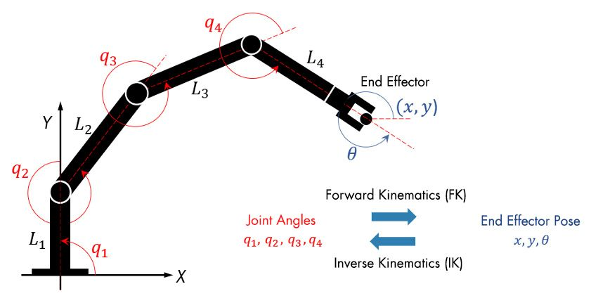

Kinematics is the study of motion without considering the cause of the motion, such as forces and torques. Inverse kinematics is the use of kinematic equations to determine the motion of a robot to reach a desired position. For example, to perform automated bin picking, a robotic arm used in a manufacturing machines. The grasping end of a robot arm is designated as the end-effector. The robot configuration is a list of joint positions that are within the position limits of the robot model and do not violate any constraints the robot has.

Given the desired robot's end-effector positions, inverse kinematics (IK) can determine an appropriate joint configuration for which the end-effectors move to the target pose.

Once the robot's joint angles are calculated using the inverse kinematics, a motion profile can be generated using the Jacobian matrix to move the end-effector from the initial to the target pose. The Jacobian matrix helps define a relationship between the robot's joint parameters and the end-effector velocities.

In contrast to forward kinematics (FK), robots with multiple revolute joints generally has multiple solutions to inverse kinematics, and various methods have been proposed according to the purpose, In general, they are classified into two methods, on that is analytically obtained (i.e., analytic solution) and the other that uses numerical calculation.

## Numerical Inverse Kinematics 
In order to approximate a robot configuration that achieves specified goals and constraints for the robot, numerical calculation can be used. Each joint angle is calculated iteratively using algorithms for optimization, such as gradient-based methods. 

Numerical IK solver are more general but require multiple steps to converge toward the solution to the non-linearity of the system, while analytic IK solver are best suited for simple IK problems. Numerical IK is more versatile in that robot kinematic constraints can be specified and external constraints, like an aiming constraint for a camera arm to point at a target location, can be set to IK solver. Determining which IK solver to apply mainly depends on the robot applications, such as real-time interactive applications, and on several performance criteria, such as the smoothness of the final pose and scalability to redundant robotics systems.

Example: [Trajectory with Multiple Kinematic Constrainst](Trajectory%20with%20Multiple%20Kinematic%20Constrainst.md) 

You can use Robotics System Toolbox and Simscrape Multibody for IK using numerical calculation. Related workflows include: 
- Creating a rigid body tree robot model
- Importing robot definitions from URDF or DH parameters
- Building a multibody model based on the information defined in CAD
- Computing the geometric Jacobian 
- Analysing inverse kinematics
- Designing inverse kinematics solver, configurations and waypoints 
- Solving the multiple-constraint kinematics configuration using generalized kinematics solvers
- Analyzing paraller link mechanism
- Generating equivalent C/C++ code and embedding it in other application

See [Robotics System Toolbox](https://in.mathworks.com/products/robotics.html) and [Simscrape Multibody](https://in.mathworks.com/products/simscape-multibody.html) for more information