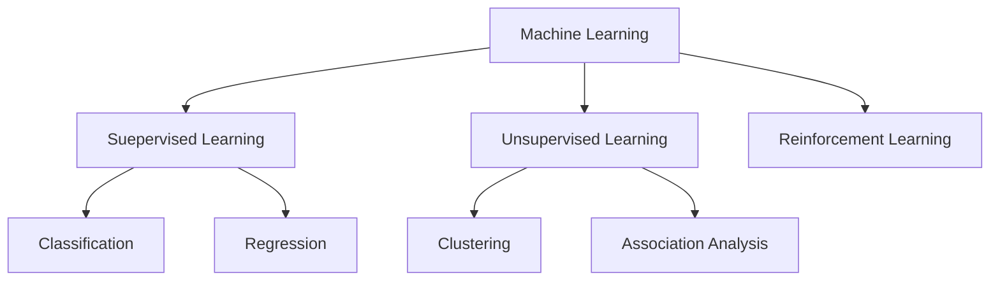

---
tags:
  - AI
---
**Machine learning algorithms** are computational models that allow computers to understand patterns and forecast or make judgments based on data without explicit programming. These algorithms form the foundation of modern artificial intelligence and are used in various applications, including image and speech recognition, natural language processing, recommendation systems, fraud detection, autonomous cars, etc.
## Types of Machine Learning
1. [Supervised Machine Learning](Supervised%20Machine%20Learning/Supervised%20Machine%20Learning.md)
2. [Unsupervised Machine Learning](Unsupervised%20Machine%20Learning/Unsupervised%20Machine%20Learning.md) :- A machine finds patterns in unknown objects by grouping similar objects together.
3. Reinforcement Learning :- A machine learns to act on its own to achieve the given goals.

