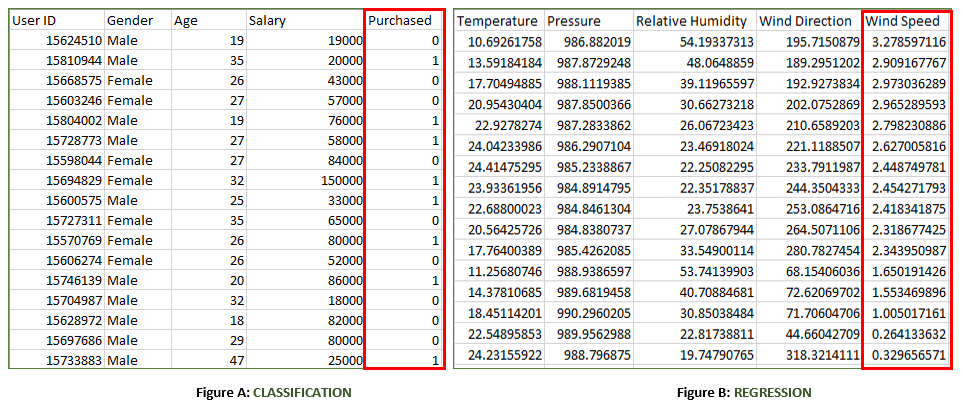

Supervised learning is a [Machine Learning](Machine%20Learning.md) technique that is widely used in various fields such as finance, healthcare, marketing, and more. It is a form of machine learning in which the algorithm is trained on labeled data to make predictions or decisions based on the data inputs.In supervised learning, the algorithm learns a mapping between the input and output data. This mapping is learned from a labeled dataset, which consists of pairs of input and output data. The algorithm tries to learn the relationship between the input and output data so that it can make accurate predictions on new, unseen data.

**Supervised learning** is where the model is trained on a labelled dataset. A **labelled** dataset is one that has both input and output parameters. In this type of learning both training and validation, datasets are labelled as shown in the figure below.

The labeled dataset used in supervised learning consists of input features and corresponding output labels. The input features are the attributes or characteristics of the data that are used to make predictions, while the output labels are the desired outcomes or targets that algorithms tries to predict.

Both the above figures have labelled data set as follows:
- **Figure A:** It is a dataset of shopping store that is useful in predicting whether a customer will purchase a particular product under consideration or not based on his/her gender, age and salary.
  **Input:** Gender, Age, Salary
  **Output:** Purchased $i.e.,$ $0 \text{ or } 1;$ $1$ means yes the customer will purchase and 0 means that the customer won't purchase it.
- **Figure B**: It is a Meteorological dataset that server the purpose of predicting wind speed based on different parameters.
  **Input:** Dew Point, Temperature, Pressure, Relative Humidity, Wind Direction
  **Output:** Wind Speed

**Training the system:** While training the model, data is usually split in the ratio of $80:20$ i.e., $80\%$ as training data and the rest as testing data. In training data, we feed input as well as output for $80\%$ of data. The model learns form training data only. We use different machine learning algorithms to build our model. Learning means that the model will build some logic of it own.