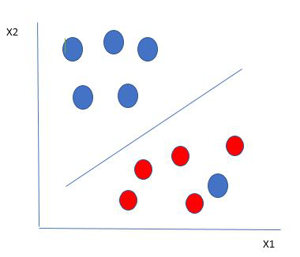
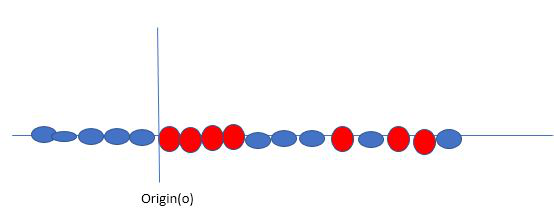

Support Vector Machine (SVM) is a [Supervised Machine Learning](Supervised%20Machine%20Learning/Supervised%20Machine%20Learning.md) algorithm used for both classification and regression. Through we say regression problems as well it's best suited for classification. The main objective of the SVM algorithm is to the optimal hyperplane in an N-dimensional space that can separate the data points in different classes in the feature space. The hyperplane tries that the margin between the closest points of different classes should be as maximum as possible. The dimension of the hyperplane depends upon the number of features. If the number of input features is two, then the hyperplane is just line. If the number of input features is three, then hyperplane becomes a 2-D plane. It becomes difficult to imagine when the number of features exceeds three.

Let’s consider two independent variables $x_{1}$, $x_{2}$, and one dependent variable which is either a blue circle or a red circle.

From the figure above it's very clear that there are multiple lines (out hyperplane here is a line because we are considering only two input features $x_{1}, x_{2}$) that segregate out data points or do a classification between red and blue circles. So how do we choose the best line or in general the best hyperplane that segregates our data points?
## Working
One reasonable choice as the best hyperplane is the one that represents the largest separation or margin between the two classes.

So we choose the hyperplane whose distance from it to the nearest data point on each side is maximized. If such a hyperplane exists it is known as the **maximum-margin hyperplane/hard margin**. So from the above figure, we choose L2. Let’s consider a scenario like shown below

Here we have one blue ball in the boundary of the red ball. So how does SVM classify the data? It's simple! The blue ball in the boundary of red ones is an [Outlier](../Neural%20Network/CNN/Outlier.md) or blue balls. The SVM algorithm has the characteristics to ignore the [Outlier](../Neural%20Network/CNN/Outlier.md) and finds the best hyperplane that maximizes the margin. SVM is robust to [Outliers](../Neural%20Network/CNN/Outlier.md).

So in this type of data point what SVM does is, finds the maximized margin as done with previous data sets along with that it adds a penalty each time a point crosses the margin. So the margins in these types of cases are called **soft margins.** When there is soft margin to the data set, the SVM tries to minimize __(1/margin+∧(∑penalty))__. Hinge loss is commonly used penalty. If no violations no hinge loss. If violations hinge loss proportional to the distance of violation.

Till now, we were talking about linearly separable data(the group of blue balls and red balls are separable by a straight line/linear line). What to do if data are not linearly separable?

Say, our data is shown in the figure above. SVM solves this by creating a new variable using a **kernel**. We call a point $x_{i}$ on the line and we create a new variable $y_{i}$ as a function of distance from origin o.so if we plot this we get something like as shown below

In this case, the new variable y is created as a function of distance from the origin. A non-linear function that creates a new variable is referred to as a kernel.

## Terminology
1. **Hyperplane:** Hyperplane is the decision boundary that is used to separate the data points of different classes in a feature space. In the case of linear classifications, it will be a linear equation i.e. wx+b = 0.
2. **Support Vectors:** Support vectors are the closest data points to the hyperplane, which makes a critical role in deciding the hyperplane and margin. 
3. **Margin**: Margin is the distance between the support vector and hyperplane. The main objective of the support vector machine algorithm is to maximize the margin.  The wider margin indicates better classification performance.
4. **Kernel**: Kernel is the mathematical function, which is used in SVM to map the original input data points into high-dimensional feature spaces, so, that the hyperplane can be easily found out even if the data points are not linearly separable in the original input space. Some of the common kernel functions are linear, polynomial, radial basis function(RBF), and sigmoid.
5. **Hard Margin:** The maximum-margin hyperplane or the hard margin hyperplane is a hyperplane that properly separates the data points of different categories without any misclassifications.
6. **Soft Margin:** When the data is not perfectly separable or contains outliers, SVM permits a soft margin technique. Each data point has a slack variable introduced by the soft-margin SVM formulation, which softens the strict margin requirement and permits certain misclassifications or violations. It discovers a compromise between increasing the margin and reducing violations.
7. **C:** Margin maximisation and misclassification fines are balanced by the regularisation parameter C in SVM. The penalty for going over the margin or misclassifying data items is decided by it. A stricter penalty is imposed with a greater value of C, which results in a smaller margin and perhaps fewer misclassifications.
8. **Hinge Loss:** A typical loss function in SVMs is hinge loss. It punishes incorrect classifications or margin violations. The objective function in SVM is frequently formed by combining it with the regularisation term.
9. **Dual Problem:** A dual Problem of the optimisation problem that requires locating the Lagrange multipliers related to the support vectors can be used to solve SVM. The dual formulation enables the use of kernel tricks and more effective computing.