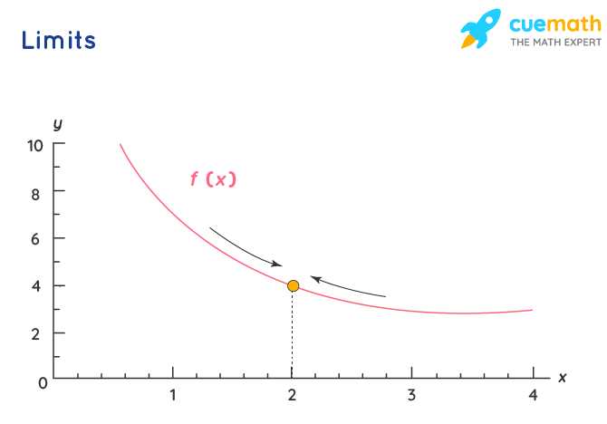

---
tags:
  - Maths
---
Limits are unique real numbers. Let us consider a real-valued function "f" and the real number "c", the limit is normally defined as $\lim_{ x \to c }f(x)$ = L. it is read as "the limit of $f$ of $x$, as $x$ approaches $c$ equals $L$". The "lim" shows the limit, and fact that function $f(x)$ approaches the limit $L$ as $x$ approaches $c$ is described by the right arrow.

## LHL and RHL
A function may approach two different limits. One where the variable approaches its limit through values larger than the limit and the other where the variable approaches its limit through values smaller than the limit. In such a case, the limit is not defined but the right and left-hand limits exist.
- When the $\lim_{ x \to a }f(x) = A^+$ given the values of $f$ near $x$ to the right of $a$. This value is said to be the right hand limit of $f(x)$ at $a$.
- When the $\lim_{ x \to a }f(x) = A^-$ given the values of $f$ near $x$ to the left of $a$. This value is called the left hand limit of $f(x)$ at $a$.
- The limit of a function exist if and only if the left-hand limit is equal to the right-hand limit. $$\lim_{ x \to a^- }f(x) = \lim_{ x \to a^+ }f(x) $$

**Note:** The limit of the function exists between any two consecutive integers.

## Properties
if limits $\lim_{ x \to a }f(x)$ and $\lim_{ x \to a }g(x)$ exists, and $n$ is an integer, then,
- Law of Addition: $$\lim_{ x \to a } [f(x) + g(x)] = \lim_{ x \to a } f(x) + \lim_{ x \to a } g(x)$$
- Law of Subtraction: $$\lim_{ x \to a } [f(x)- g(x)] = \lim_{ x \to a } f(x)- \lim_{ x \to a } g(x)$$
- Law of Multiplication: $$\lim_{ x \to a } [f(x). g(x)] = \lim_{ x \to a } f(x). \lim_{ x \to a } g(x)$$
- Law of Division: $$\lim_{ x \to a } \left[ \frac{f(x)}{g(x)} \right] = \frac{\lim_{ x \to a } f(x)}{\lim_{ x \to a } g(x)}, \text{where} \lim_{ x \to a } g(x) \ne 0$$

## Special Rules
1. $\lim_{ x \to a }\frac{x^n- a^n}{x-a}=na^{(n-1)}$, for all real values of $n$.
2. $\lim_{ \theta \to 0 }\frac{\sin \theta}{\theta}=1$
3. $\lim_{ \theta \to 0 }\frac{\tan \theta}{\theta}=1$
4. $\lim_{ \theta \to 0 }\frac{1-\cos \theta}{\theta}=0$
5. $\lim_{ x \to 0 }\cos \theta=1$
6. $\lim_{ x \to 0 }e^x=1$
7. $\lim_{ x \to 0 }\frac{e^x-1}{x}=1$
8. $\lim_{ x \to \infty }\left(1+ \frac{1}{x}\right)=e$

## Standard Limits
1. [Trigonometric Limits](Trigonometric%20Limits.md) 
2. $$\lim_{ x \to \infty } a^x \begin{cases}0 &\text{if} & 0\le a<1 \\1 &\text{if} & a=1 \\\infty  & \text{if} & a>1 \\ \text{D.N.E} & if & a<0\end{cases}$$
3. [Exponential And Logarithmic Limits](Exponential%20And%20Logarithmic%20Limits.md) 

## Limit of a Function of Two Variable
If we have a function f (x, y) which depends on two variable $x$ and $y$, then this given function has the limit, say, $C$ as $(x, y)\to(a,b)$ provided that $\epsilon > 0$, there exists $\triangle>0$ such that $|f(x,y)-C|< \epsilon$ whenever $0<\sqrt{ (x-a)^2 + (y-b)^2 }<\triangle$. It defined as $\lim_{ (x,y) \to (a,b) } f(x,y)=C$.

## Limit of the Form $1^{\infty}$
 

---
Related Links:-
- [L'Hospital Rule](L'Hospital%20Rule.md) 
- [Limits of Exponential Functions](Limits%20of%20Exponential%20Functions.md) 
- [Indeterminate Forms](Indeterminate%20Forms.md) 
