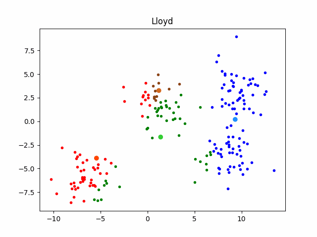

It is an **Unsupervised Machine Learning algorithm**, which groups the **unlabeled dataset** into difference clusters.
'K' in the name of algorithm represents the number of groups/clusters we want to classify out items into.
It starts by randomly assigning the clusters centroid in the space. Then each data point assign to one of the clusters based on its [Euclidean Distance](Euclidean%20Distance.md) from centroid of the cluster. After assigning each point to one of the cluster, new cluster centroid are assigned. This process runs iteratively until it finds good cluster. In the analysis we assume that number of cluster is given in advanced and we have to put points in one of the group (cluster).

### Objective
The objective of k-means clustering is to divide the population or set of data points into a number of groups so that the data points within each group are more comparable to one another and difference from the data points within the other groups. It is essentially a grouping of things based on how similar and different they are to one another.

### Working
We are given a data set of items, with certain features, and values for these features (like a vector). The task is to categorize those items into groups (clusters). 

The algorithm works as follows:
1. **Select the number of clusters (k)**
	- Choose how many clusters you want to segment the data into.
2. **Initialize centroids randomly**
	- Select `k` random points from the dataset as initial cluster centroids (starting centers).
3. **Assign data points to the nearest centroid**
	- For each data point, compute the [Euclidean Distance](Euclidean%20Distance.md) to all centroids.
	- Assign the data point to the cluster with the nearest centroid.
4. **Update centroids**
	- For each cluster, calculate the new centroid by averaging the coordinates of the points assigned to it.
5. **Repeat assignment and update steps**
	- Re-assign points to clusters based on the new centroids.
	- Re-calculate centroids based on the updated clusters.
6. **Check for convergence**
	- If the centroids no longer change (or change is minimal), or a maximum number of iterations is reached, stop. 
7. **Output the clusters and centroids**
	- The algorithm return the final clusters and their corresponding centroids.

