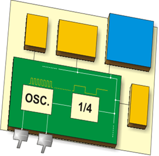

Even pulses generated by the oscillator enable harmonic and synchronous operation of all circuits within the microcontroller. The oscillator is usually configured so as to use quartz crystal or ceramic resonator for frequency stability, but it can also operate as a stand-alone circuit (like RC oscillator). It is important to say that instructions are not executed at the rate imposed by the oscillator itself, but several times slower. It happens because each instruction is executed in several steps. In some microcontrollers, the same number of cycles is needed to execute all instructions, while in others, the number of cycles is different for different instructions. Accordingly, if the system uses quartz crystal with a frequency of 20 Mhz, the execution time of an instruction is not 50nS, but 200, 400 or 800 nS, depending on the type of MCU!

