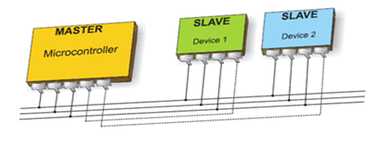

---
tags:
  - Microcontroller
---
A serial peripheral interface (SPI) bus is a system for serial communication which uses up to four conductors, commonly three. One conductor is used for data receiving, one for data sending, one for synchronization and one alternatively for selecting a device to communicate with. It is a full duplex connection, which means that data is sent and received simultaneously.

The maximum baud rate is higher than that in the [I 2 C communication system](Inter%20Integrated%20Circuit%20(I2C).md).

