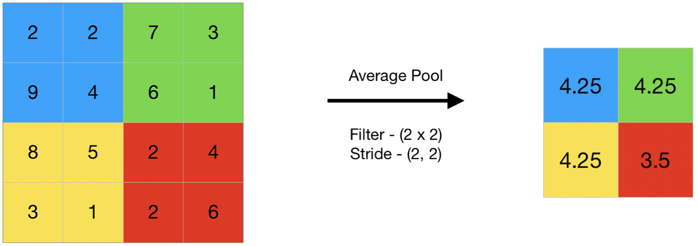

Average [Pooling](Pooling%20Layer.md) computes the average of the elements present in the region of feature map covered by the filter. Thus, while [Max Pooling](Max%20Pooling.md), give the most prominent feature in a particular patch of feature map, average pooling give the average of feature present in a patch.

**Performing Average Pooling using keras**
```python
import numpy as np
from keras.models import Sequential
from keras.layers import AveragePooling2D

# define input image
image = np.array([[2.0, 2.0, 7.0, 3.0],
                  [9.0, 4.0, 6.0, 1.0],
                  [8.0, 5.0, 2.0, 4.0],
                  [3.0, 1.0, 2.0, 6.0]])
image = image.reshape(1.0, 4.0, 4.0, 1.0)

# define model containing just a single average pooling layer
model = Sequential(
    [AveragePooling2D(pool_size = 2, strides = 2)])

# generate pooled output
output = model.predict(image)

# print output image
output = np.squeeze(output)
print(output)
```
**Output:**
```
[[4.25 4.25]  
[4.25 3.5 ]]
```
