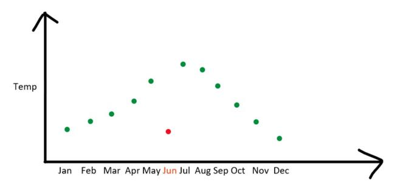
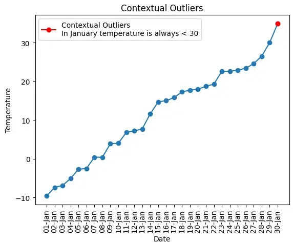

These are the [Outlier](Outlier.md) that is identified within a specific context or condition. In other words, the data point which may not be considered an outlier normally, but when we take into account the domain knowledge they become outliers. They are often analyzed in situations where the data varies based on different factors or attributes.

Compressive Information:-
1. **Definition:** Contextual outliers are data points that deviate significantly from the expected behavior within a specific context or subgroup.  
2. **Characteristics:** Contextual outliers may not be outliers when considered in the entire dataset, but they exhibit unusual behavior within a specific context or subgroup.  
3. **Detection:** Techniques for detecting contextual outliers include contextual clustering, contextual anomaly detection, and context-aware machine learning approaches.  
4. **Contextual Information:** Contextual information such as time, location, or other relevant factors are crucial in identifying contextual outliers.  
5. **Impact:** Contextual outliers can represent unusual or anomalous behavior within a specific context, which may require further investigation or          attention.  
6. **Handling:** Handling contextual outliers may involve considering the contextual information, contextual normalization or transformation of data, or using context-specific models or algorithms.  
7. **Considerations:** Proper understanding of the context and domain-specific knowledge is crucial for accurate detection and interpretation of contextual outliers, as they may vary based on the specific context or subgroup being considered.



Here are some example of contextual outliers:
- **Temperature Anomaly**: Imagine you’re monitoring the daily temperature in a city for a year. Most of the time, the temperature falls within a certain range. However, if there’s a day in the summer when the temperature suddenly drops significantly, that day’s temperature would be a contextual outlier because it deviates from the expected temperature for that season.
- **Stock Market Fluctuations:** In the stock market, the daily price of a stable stock may not be considered an outlier if it remains within a certain range. However, if a stock experiences a sudden and sharp price increase or decrease during a specific news event or earnings report, that day’s price change might be considered a contextual outlier within the context of that event.
- **Website Traffic**: A website usually has a fairly consistent number of daily visitors. However, during a major event, such as a product launch or a viral social media post, the website’s daily traffic might spike significantly. The days with high traffic would be contextual outliers within the context of normal daily traffic.
- **Retail Sales**: In a retail store, certain products may have steady sales figures throughout the year. However, during a holiday season or a special promotion, the sales of those products may increase substantially, making those sales periods contextual outliers in terms of sales volume.
- **Hospital Admissions**: In a hospital, the number of daily patient admissions typically follows a pattern. However, during a disease outbreak or a natural disaster, the hospital may experience a sudden surge in patient admissions, making those days contextual outliers in terms of hospital utilization. 

Identifying and analyzing contextual outlier is important in various fields, such as statistics, finance, and anomaly detection, as they can provide valuable insights into unique events or conditions that affects the data 
# Points
- Datapoints that deviates from the norm when specific conditions or context is taken into account.
- These are detected by first defining the relevant context or condition within which they are outliers. Then, outlier detection techniques are applied within that context to identify data points that deviate significantly from the norm within that subset.
- It provides valuable insight when analyzing under certain conditions.

```python
import pandas as pd
import random
import numpy as np
from datetime import datetime, timedelta
import matplotlib.pyplot as plt

# Generate random data for the dataset
random_data = {
	'Date': [datetime(2023, 1, 1) + timedelta(days=i) for i in range(30)],
	'Temperature': np.sort([round(random.uniform(-10.0, 40.0), 1) for _ in range(30)]
						)
}

# Create the DataFrame
data = pd.DataFrame(random_data)

# Mark temperature values greater than 35 as contextual outliers
contextual_outlier_index = data['Temperature'] > 30

# Format date to show only date and month
data['Date'] = data['Date'].dt.strftime('%d-%b')

# Visualize the data
plt.plot(data['Date'], data['Temperature'], marker="o")
plt.plot(data['Date'][contextual_outlier_index],
		data['Temperature'][contextual_outlier_index],
		'ro-', label="Contextual Outliers\nIn January temperature is always < 30")

plt.xlabel('Date')
plt.ylabel('Temperature')
plt.title('Contextual Outliers')
plt.legend()
# Rotate x-axis labels for better visibility
plt.xticks(rotation=90) 
plt.show()
```


Detecting contextual outliers typically involves defining the relevant conditions or contexts and then applying outlier detection techniques within those specific subsets of the data. The choice of contextual factors and the methods for identifying and handling contextual outliers will depend on the nature of the data and the goals of the analysis.