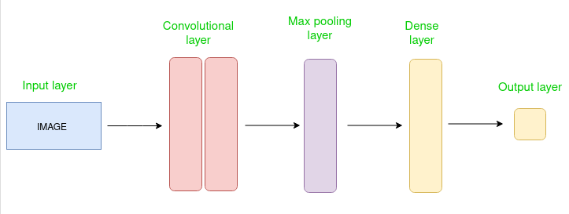

---
aliases:
  - CNN
  - Convolution Layer
tags:
  - AI
---
# CNN
Convolutional Neural Network (CNN) is the extended version of artificial neural networks (ANN) which is predominantly used to extract the feature from the grid-like matrix dataset. For example visual datasets like images or videos where data patterns play an extensive role.


The example above uses a robot as the input image and multiple feature maps for processing. You can see that the model produces an output via convolutions and subsampling.
## Architecture
Convolutional Neural Network consists of multiple layers like the input layer, Convolutional layer, [Pooling Layer](Pooling%20Layer.md), and fully connected layers. 


The Convolutional layer applies filters to the input image to extract features, the [Pooling Layer](Pooling%20Layer.md) downsamples the image to reduce computation, and the fully connected layer makes the final prediction. The network learns the optimal filters through backpropagation and gradient descent. 
## Working
Convolution Neural Networks or covnets are neural networks that share their parameters. Imagine you have an image. It can be represented as a cuboid having its length, width (dimension of the image), and height (i.e the channel as images generally have red, green, and blue channels).
 

Now imagine taking a small patch of this image and running a small neural network, called a filter or kernel on it, with say, K outputs and representing them vertically. Now slide that neural network across the whole image, as a result, we will get another image with different widths, heights, and depths. Instead of just R, G, and B channels now we have more channels but lesser width and height. This operation is called **Convolution**. If the patch size is the same as that of the image it will be a regular neural network. Because of this small patch, we have fewer weights.


## Mathematical Overview
Now let’s talk about a bit of mathematics that is involved in the whole convolution process. 

- Convolution layers consist of a set of learnable filters (or kernels) having small widths and heights and the same depth as that of input volume (3 if the input layer is image input).
- For example, if we have to run convolution on an image with dimensions 34x34x3. The possible size of filters can be axax3, where ‘a’ can be anything like 3, 5, or 7 but smaller as compared to the image dimension.
- During the forward pass, we slide each filter across the whole input volume step by step where each step is called **stride** (which can have a value of 2, 3, or even 4 for high-dimensional images) and compute the dot product between the kernel weights and patch from input volume.
- As we slide our filters we’ll get a 2-D output for each filter and we’ll stack them together as a result, we’ll get output volume having a depth equal to the number of filters. The network will learn all the filters.

## Layers Used To Build ConvNets
A complete Convolution Neural Networks architecture is also known as covnets. A covnets is a sequence of layers, and every layer transforms one volume to another through a differentiable function.   
**Types of layers:** datasets  
Let’s take an example by running a covnets on of image of dimension $32 \times 32 \times 3$.

- **Input Layers:** It’s the layer in which we give input to our model. In CNN, Generally, the input will be an image or a sequence of images. This layer holds the raw input of the image with width 32, height 32, and depth 3.
- **Convolutional Layers:** This is the layer, which is used to extract the feature from the input dataset. It applies a set of learnable filters known as the kernels to the input images. The filters/kernels are smaller matrices usually 2×2, 3×3, or 5×5 shape. it slides over the input image data and computes the dot product between kernel weight and the corresponding input image patch. The output of this layer is referred as feature maps. Suppose we use a total of 12 filters for this layer we’ll get an output volume of dimension 32 x 32 x 12.
- **[Activation Functions](Object%20Detection/Activation%20Functions.md):** By adding an activation function to the output of the preceding layer, activation layers add nonlinearity to the network. it will apply an element-wise activation function to the output of the convolution layer. Some common activation functions are **[ReLU](Object%20Detection/ReLU%20Activation%20Function.md)**, **Tanh**, **Leaky RELU**, etc. The volume remains unchanged hence output volume will have dimensions 32 x 32 x 12.
- **[Pooling Layer](Pooling%20Layer.md):** This layer is periodically inserted in the covnets and its main function is to reduce the size of volume which makes the computation fast reduces memory and also prevents overfitting. Two common types of pooling layers are **max pooling** and **average pooling**. If we use a max pool with 2 x 2 filters and stride 2, the resultant volume will be of dimension 16x16x12.
- **Flattening:** The resulting feature maps are flattened into a one-dimensional vector after the convolution and pooling layers so they can be passed into a completely linked layer for categorization or regression.
- **[Fully Connected Layers](Object%20Detection/Fully%20Connected%20Layer.md):** It takes the input from the previous layer and computes the final classification or regression task.


- **Output Layer:** The output from the fully connected layers is then fed into a logistic function for classification tasks like sigmoid or [Softmax](../../B.Tech/Computer%20Science/Deep%20Learning/Softmax%20Layer.md) which converts the output of each class into the probability score of each class.

## Example: Applying CNN to an Image
Let’s consider an image and apply the convolution layer, activation layer, and pooling layer operation to extract the inside feature.

**Input Image:**


#### Step:
- import the necessary libraries
- set the parameter
- define the kernel
- Load the image and plot it.
- Reformat the image 
- Apply convolution layer operation and plot the output image.
- Apply activation layer operation and plot the output image.
- Apply pooling layer operation and plot the output image.

```python
# import the necessary libraries
import numpy as np
import tensorflow as tf
import matplotlib.pyplot as plt
from itertools import product

# set the param 
plt.rc('figure', autolayout=True)
plt.rc('image', cmap='magma')

# define the kernel
kernel = tf.constant([[-1, -1, -1],
                    [-1,  8, -1],
                    [-1, -1, -1],
                   ])

# load the image
image = tf.io.read_file('Ganesh.jpg')
image = tf.io.decode_jpeg(image, channels=1)
image = tf.image.resize(image, size=[300, 300])

# plot the image
img = tf.squeeze(image).numpy()
plt.figure(figsize=(5, 5))
plt.imshow(img, cmap='gray')
plt.axis('off')
plt.title('Original Gray Scale image')
plt.show();


# Reformat
image = tf.image.convert_image_dtype(image, dtype=tf.float32)
image = tf.expand_dims(image, axis=0)
kernel = tf.reshape(kernel, [*kernel.shape, 1, 1])
kernel = tf.cast(kernel, dtype=tf.float32)

# convolution layer
conv_fn = tf.nn.conv2d

image_filter = conv_fn(
    input=image,
    filters=kernel,
    strides=1, # or (1, 1)
    padding='SAME',
)

plt.figure(figsize=(15, 5))

# Plot the convolved image
plt.subplot(1, 3, 1)

plt.imshow(
    tf.squeeze(image_filter)
)
plt.axis('off')
plt.title('Convolution')

# activation layer
relu_fn = tf.nn.relu
# Image detection
image_detect = relu_fn(image_filter)

plt.subplot(1, 3, 2)
plt.imshow(
    # Reformat for plotting
    tf.squeeze(image_detect)
)

plt.axis('off')
plt.title('Activation')

# Pooling layer
pool = tf.nn.pool
image_condense = pool(input=image_detect, 
                             window_shape=(2, 2),
                             pooling_type='MAX',
                             strides=(2, 2),
                             padding='SAME',
                            )

plt.subplot(1, 3, 3)
plt.imshow(tf.squeeze(image_condense))
plt.axis('off')
plt.title('Pooling')
plt.show()

```

**Output:**


## Advantages
1. Good at detecting patterns and features in images, videos, and audio signals.
2. Robust to translation, rotation, and scaling invariance.
3. End-to-end training, no need for manual feature extraction.
4. Can handle large amounts of data and achieve high accuracy.

## Disadvantage 
1. Computationally expensive to train and require a lot of memory.
2. Can be prone to overfitting if not enough data or proper regularization is used.
3. Requires large amounts of labeled data.
4. Interpretability is limited, it’s hard to understand what the network has learned.

## Formula to Calculate Output Size
**The formula for computing the output size of a convolutional layer**
$$
w_{out} = \frac{w_{in}-K+2P}{S} + 1
$$
$$
h_{out} = \frac{h_{in}-K+2P}{S} + 1
$$
Where, 
- $w_{in}$ and $h_{in}$ are the input image dimensions.
- $K$ is the kernel size.
- $S$ is the Stride. 
- $P$ is Padding.