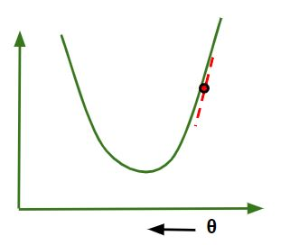
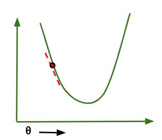
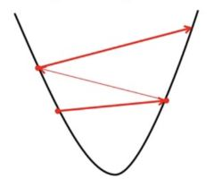

---
tags:
  - AI
---
Gradient Descent is an iterative optimization algorithm that tries to find the optimum value (Minimum/Maximum) of an objective function. It is one of the most used optimization techniques in [Machine Learning](../../Machine%20Learning/Machine%20Learning.md) projects for updating the parameters of a model in order to minimize a cost function.

The main aim off gradient descent is to find the best parameters of a model which gives the highest on training as well as testing datasets. In gradient descent, The gradient is a [Vector](../../Science/Maths/Vectors/Vector.md) that points in the direction of the steepest increase of the function at a specific point. Moving in the opposite direction of the gradient allows the algorithm to gradually descend towards lower values of the function, and eventually reaching to the minimum of the function.
### Steps Required
- **Step-1**: We first initialize the parameters of the model randomly.
- **Step-2**: Compute the gradient of the cost function with respect to each parameter. It involves making partial differentiation of the cost (loss) function with respect to the parameters.
- **Step-3**: Update the parameters of the model by taking steps in the opposite direction of the model. Here we choose a hyperparameter learning rate which is denoted by alpha. It helps in deciding the step size of the gradient.
- **Step-4**: Repeat steps 2 and 3 iteratively to get the best parameter for the defined model.

### Pseudocode
```
t ← 0  
max_iterations ← 1000  
w, b ← initialize randomly  
  
while t < max_iterations do  
    t ← t + 1  
    w_t+1 ← w_t − η ∇w_t  
    b_t+1 ← b_t − η ∇b_t  
end
```
Here,
- `max_iterations` is the number of iterations we want to do to update out parameter
- `W, b` are the weight and bias parameter
- `η` is the learning parameter also denoted by alpha.

To apply this gradient descent on data using any programming language we have to make four new function using which we can update our parameter and apply it to data to make a prediction. We will see each function one by one and understand it.
1. **gradient_descent-** In the gradient descent function we will make the prediction on a dataset and compute the difference between the predicted and actual target value and accordingly we will update the parameter and hence it will return the updated parameter.
2. **compute_prediction-** In this function, we will compute the prediction using the parameters at each iteration.
3. **compute_gradient-** In this function we will compute the error which is the difference between the actual and predicted target value and then compute the gradient using this error and training data.
4. **update_parameters-** In this separate function we will update the parameter using learning late and gradient that we got from the **compute_gradient** function.

```
function gradient_descent(X, y, learning_rate, num_iterations):  
    Initialize parameters  = θ  
    for iter in range(num_iterations):  
        predictions = compute_predictions(X, θ)  
        gradient = compute_gradient(X, y, predictions)  
        update_parameters(θ, gradient, learning_rate)  
    return θ  
  
function compute_predictions(X, θ):  
    return X*θ  
  
function compute_gradient(X, y, predictions):  
    error = predictions - y  
    gradient = Xᵀ * error / m  
    return gradient  
  
function update_parameters(θ, gradient, learning_rate):  
    θ = θ - learning_rate ⨉ gradient
```
## Behind Mathematics
In the [Machine Learning](../../Machine%20Learning/Machine%20Learning.md) Regression problem, our model targets to get the best-fit regression line to predict the value $y$ based on the given input value $(x)$. While training the model, the model calculates the cost (loss) function like Root [Mean Squared Error](Mean%20Squared%20Error.md) between the predicted value (pred) and true value $(y)$. Our model targets to minimize this cost function.

To minimize this cost function, the model needs to have the best value of $\theta_1$ and $\theta_{2}$ (for Univariate linear regression problem). Initially model selects $\theta_{1}$ and $\theta_{2}$ values randomly and then iteratively update these value in order to minimize the cost (loss) function until it reaches the minimum. By the time model achieves the minimum cost (loss) function. It will have the best $\theta_{1}$ and $\theta_{2}$ values. Using these updated values of $\theta_{1}$ and t $\theta_{2}$ in the hypothesis equation of linear equation, our model will predict the output value y.
### How Does Gradient Descent Work
Gradient descent works by moving downward toward the pits or valleys in the graph to find the minimum value. This is achieved by taking the derivative of the cost (loss) function, as illustrated in the figure below. During each iteration, gradient descent step-downs the cost (loss) function in the direction of the steepest descent. By adjusting the parameters in this direction, it seeks to reach the minimum of the cost function and find the best-fit value for the parameters. The size of each step is determined by parameter $\alpha$ known as **Learning Rate**.
In the Gradient Descent algorithms on can infer two points:
- If slope is $+ve:\theta_{j} = \theta_{j}-(+ve \text{ value})$. Hence the value of $\theta_{j}$ decreases.


- If slope is $-ve:\theta_{j}=\theta_{j}-(-ve \text{ value})$. Hence the value of $\theta_{j}$ increases.


## Choosing Learning Rate
The choice of correct learning rate is very important as it ensures that Gradient Descent converges in a reasonable time:
- It we choose **$\alpha$ to ve very large**, Gradient Descent can overshoot the minimum. It may fail to converge or even diverge.


- If we choose $\alpha$ to be very small, Gradient Descent will take small steps to reach local minima and will take longer time to reach minima.


## Python Implementation
At first, we will import all the necessary Python libraries that we will need for mathematical computation and plotting like numpy for mathematical operations and matplotlib for plotting. Then we will define a class **Linear_Regression** that represents the linear regression model.

We will make a **update_coeffs** method inside the class to update the coefficients (parameters) of the linear regression model using gradient descent. To calculate the error between the predicted output and the actual output wee will make a **predict** method that will make prediction using the current model coefficients.

For updating and calculating the gradient of the error we will make **compute_cost** which will apply gradient on (mean squared error) between the predicted values and the actual values.

```python
# Implementation of gradient descent in linear regression
import numpy as np
import matplotlib.pyplot as plt


class Linear_Regression:
    def __init__(self, X, Y):
        self.X = X
        self.Y = Y
        self.b = [0, 0]

    def update_coeffs(self, learning_rate):
        Y_pred = self.predict()
        Y = self.Y
        m = len(Y)
        self.b[0] = self.b[0] - (learning_rate * ((1/m) *
                                                  np.sum(Y_pred - Y)))

        self.b[1] = self.b[1] - (learning_rate * ((1/m) *
                                                  np.sum((Y_pred - Y) * self.X)))

    def predict(self, X=[]):
        Y_pred = np.array([])
        if not X:
            X = self.X
        b = self.b
        for x in X:
            Y_pred = np.append(Y_pred, b[0] + (b[1] * x))

        return Y_pred

    def get_current_accuracy(self, Y_pred):
        p, e = Y_pred, self.Y
        n = len(Y_pred)
        return 1-sum(
            [
                abs(p[i]-e[i])/e[i]
                for i in range(n)
                if e[i] != 0]
        )/n
    # def predict(self, b, yi):

    def compute_cost(self, Y_pred):
        m = len(self.Y)
        J = (1 / 2*m) * (np.sum(Y_pred - self.Y)**2)
        return J

    def plot_best_fit(self, Y_pred, fig):
        f = plt.figure(fig)
        plt.scatter(self.X, self.Y, color='b')
        plt.plot(self.X, Y_pred, color='g')
        f.show()


def main():
    X = np.array([i for i in range(11)])
    Y = np.array([2*i for i in range(11)])

    regressor = Linear_Regression(X, Y)

    iterations = 0
    steps = 100
    learning_rate = 0.01
    costs = []

    # original best-fit line
    Y_pred = regressor.predict()
    regressor.plot_best_fit(Y_pred, 'Initial Best Fit Line')

    while 1:
        Y_pred = regressor.predict()
        cost = regressor.compute_cost(Y_pred)
        costs.append(cost)
        regressor.update_coeffs(learning_rate)

        iterations += 1
        if iterations % steps == 0:
            print(iterations, "epochs elapsed")
            print("Current accuracy is :",
                  regressor.get_current_accuracy(Y_pred))

            stop = input("Do you want to stop (y/*)??")
            if stop == "y":
                break

    # final best-fit line
    regressor.plot_best_fit(Y_pred, 'Final Best Fit Line')

    # plot to verify cost function decreases
    h = plt.figure('Verification')
    plt.plot(range(iterations), costs, color='b')
    h.show()

    # if user wants to predict using the regressor:
    regressor.predict([i for i in range(10)])


if __name__ == '__main__':
    main()
```

---
See also:-
- [Stochastic Gradient Descent](Stochastic%20Gradient%20Descent.md)