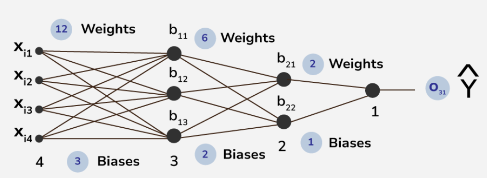

Forward propagation is the process in a neural network where the input data is passed through the network’s layers to generate an output. It involves the following steps:

1. **Input Layer:** The input data is fed into the input layer of the neural network.
2. **Hidden Layers:** The input data is processed through one or more hidden layers. Each neuron in a hidden layer receives inputs from the previous layer, applies an activation function to the weighted sum of these inputs, and passes the result to the next layer.
3. **Output Layer:** The processed data moves through the output layer, where the final output of the network is generated. The output layer typically applies an activation function suitable for the task, such as softmax for classification or linear activation for regression.
4. **Prediction:** The final output of the network is the prediction or classification result for the input data.

Forward propagation is essential for making predictions in [neural networks](https://www.geeksforgeeks.org/neural-networks-a-beginners-guide/). It calculates the output of the network for a given input based on the current values of the weights and biases. The output is then compared to the actual target value to calculate the loss, which is used to update the weights and biases during the training process.
## Mathematical Explanation of Forward Propagation

- In the above picture , the first layer of $X_{i1}$ , $X_{i2}$ , $X_{i3}$ , $X_{i4}$ are the input layer and last layer of $b_{31}$ is the output layer .
- Other layers are hidden layers in this structure of ANN . this is a 4 layered deep ANN where first hidden layer consists of 3 neuron and second layer consists of 2 neuron .
- There are total 26 trainable parameters . here , in hidden layer 1 , the top to bottom biases are $b_{11}$ , $b_{12}$ , $b_{13}$ and in hidden layer 2 , the top to bottom biases are $b_{21}$, $b_{22}$ . the output layer contains the neuron having bias b31 . likewise the weights of corresponding connections are assigned like $W_{111}$, $W_{112}$, $W_{113}$ , $W_{121}$, $W_{122}$ etc.
- Here, considering we are using [sigmoid](https://www.geeksforgeeks.org/derivative-of-the-sigmoid-function/) function as the activation function

$$
\sigma\left(\begin{bmatrix} W_{111} & W_{112} & W_{113} \\ W_{121} & W_{122} & W_{123} \\ W_{131} & W_{132} & W_{133} \\ W_{141} & W_{142} & W_{143} \end{bmatrix}^T \begin{bmatrix} X_{i1} \\ X_{i2} \\ X_{i3} \\ X_{i4} \end{bmatrix} + \begin{bmatrix} b_{11} \\ b_{12} \\ b_{13} \end{bmatrix}\right) = \sigma\left(\begin{bmatrix} W_{111}X_{i1} + W_{121}X_{i2} + W_{131}X_{i3} + W_{141}X_{i4} \\ W_{112}X_{i1} + W_{122}X_{i2} + W_{132}X_{i3} + W_{142}X_{i4} \\ W_{113}X_{i1} + W_{123}X_{i2} + W_{133}X_{i3} + W_{143}X_{i4} \end{bmatrix} + \begin{bmatrix} b_{11} \\ b_{12} \\ b_{13} \end{bmatrix}\right) = \sigma\left(\begin{bmatrix} W_{111}X_{i1} + W_{121}X_{i2} + W_{131}X_{i3} + W_{141}X_{i4} + b_{11} \\ W_{112}X_{i1} + W_{122}X_{i2} + W_{132}X_{i3} + W_{142}X_{i4} + b_{12} \\ W_{113}X_{i1} + W_{123}X_{i2} + W_{133}X_{i3} + W_{143}X_{i4} + b_{13} \end{bmatrix}\right) = \begin{bmatrix} O_{11} \\ O_{12} \\ O_{13} \end{bmatrix} = a^{[1]}
$$
