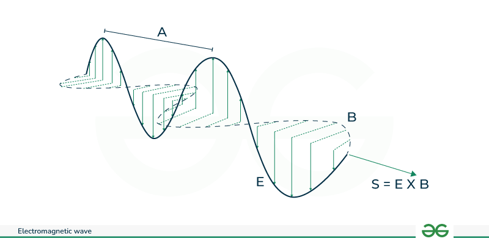

It is used to tell how much energy is being carried by an electromagnetic wave in a unit area. It is denoted by letter ***S***. Thereby, this vector helps us understand how the transfer of energy works, and how can we determine the direction where energy is going to flow. 

The physical interpretation of Poynting vector can be understood by [Poynting Theorem](Poynting%20Theorem.md).
## Formula
It is the **cross product of electric field (E) and magnetic field (B)**, respectively.
$$
\vec{S} \equiv \frac{1}{\mu_{o}}\left( \vec{E} \vec{\times}B \right)
$$
Where,
- $\vec{E}$: The electric field vector.
- $\vec{B}$: The magnetic field vector.
- $\mu_{o}$: The permeability of free space ($\mu_{o} \approx 4\pi \times 10^{-7} \text{ N/}\text{A}^2$)

## Physical Significance
- It describes the flow of energy in an electromagnetic field.
- It points in the direction of energy propagation.
- It's magnitude gives the rate of energy transfer per unit area, measured in watts per square meter (W/m$^2$).
- It relates the energy balance in a system through the [Poynting Theorem](Poynting%20Theorem.md), which links it to the rate of energy change and work done o charges.
## Applications
- Describes the power flow in waveguides and transmission lines.
- Explains radiation patterns from antennas.
- Analyzes energy transfer in optical system like laser and fibers.