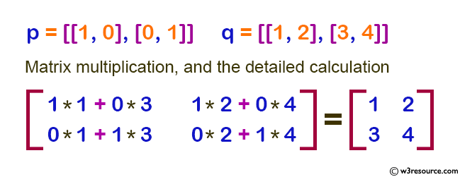

---
tags:
  - numpy
  - python
---
Write a NumPy program to compute the multiplication of two given matrixes.

**Sample Matrix:**
```
[[1, 0], [0, 1]]
[[1, 2], [3, 4]]
```
**Matrix multiplication, and the detailed calculation:**

**Solution:-**
```python
import numpy as np

# Define two 2x2 matrices 'p' and 'q'
p = [[1, 0], [0, 1]]
q = [[1, 2], [3, 4]]

# Display the original matrices 'p' and 'q'
print("Original matrices:")
print(p)
print(q)

# Perform matrix multiplication using np.dot
result1 = np.dot(p, q)

# Display the result of the matrix multiplication
print("Result of the matrix multiplication:")
print(result1) 
```
```
original matrix:
[[1, 0], [0, 1]]
[[1, 2], [3, 4]]
Result of the said matrix multiplication:
[[1 2]
 [3 4]]
```
---
- Related Links:-
	- [numpy.dot](https://numpy.org/doc/stable/reference/generated/numpy.dot.html)
	- [Matrices](../../../Science/Maths/Matrices/Matrices.md)