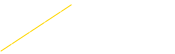
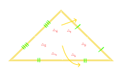
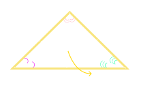

---
tags:
  - Maths
---
# Harmonic Conjugate 
---

If $P$ divides $AB$ internally & Q divides AB externally in ratio $m:n$ then $P$ & $Q$ are called as Harmonic Conjugates of each other $w.r.t$ AB.

Mathematically,
$$
\boxed{\frac{2}{AB} = \frac{1}{AQ} + \frac{1}{AP}} \ i.e, AP, AB, AQ \text{ 
are in H.P}
$$
# Centers of Triangles
---
### 1. Centroid:-
- Point of intersection of three [medians](../Straight%20Line/Median.md) of triangle.
-  Centroid divides each [Median](Median.md) in ratio 2:1 greater part being towards vertex
-  Centroid always lies inside a triangle..
  $$
  \boxed{G = \left(\frac{x_1 + x_2 + x_3}{3},\frac{y_1 + y_2 +y_3}{3}\right)}
  $$
  
  
  
  
 
### 2. InCenter
- Point of intersection of the three [internal angle bisector](Internal%20Angle%20Bisector%20Theorem.md)  of a triangle.
- Center of the circle touching all the sides of triangle.
- Incenter is equidistant from each side of the triangle (measured by a perpendicular line.)
$$
I = \left( \frac{ax_{1}+bx_{2}+cx_{3}}{a+b+c}, \frac{ay_{1}+by_{2}+cy_{3}}{a+b+c} \right)
$$

[Circumcenter (C)](Circumcenter%20(C).md) 
[Orthocenter (H)](Orthocenter%20(H).md) 
